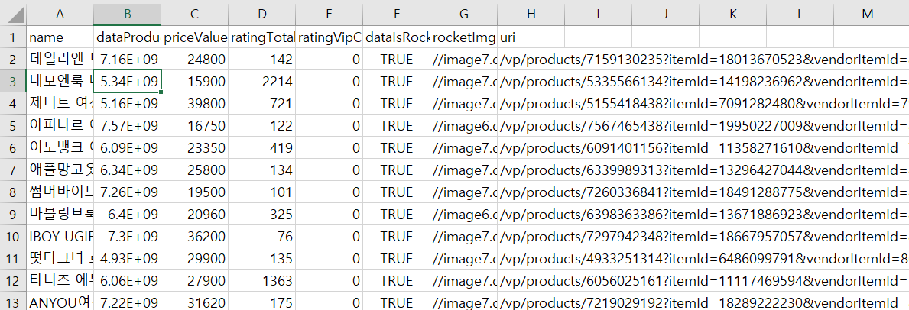

리액트에서 엑셀파일을 다운받는 기능을 구현해보자

라이브러리 쓰면 바로 해결된다.

```jsx
 import { CSVLink } from "react-csv";

export default function Result({ minPrice, maxPrice, searchSize }) {
  const [list, setList] = useState([]);
  const [loading, setLoading] = useState(true);
 //어쩌구 본문

return (
//어쩌꾸 jsx

<CSVLink data={list}>Download me</CSVLink>;
//data에 엑셀에 표시할 배열 객체를 넣어주면 된다.
//여기서 리스트는 fetch 해온 data의 배열 객체이다.

)
}

```


download me를 클릭하면 엑셀파일을 다운받을 수 있다.

다만 현재 fetch한 data 값 그 자체를 엑셀에 넣었기 때문에



유저가 쓸 수 없는 값으로 나오긴한다.

차후 유저에게 유의미한 정보를 추출해서 수정하도록하자.
