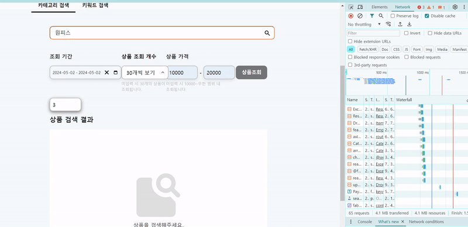
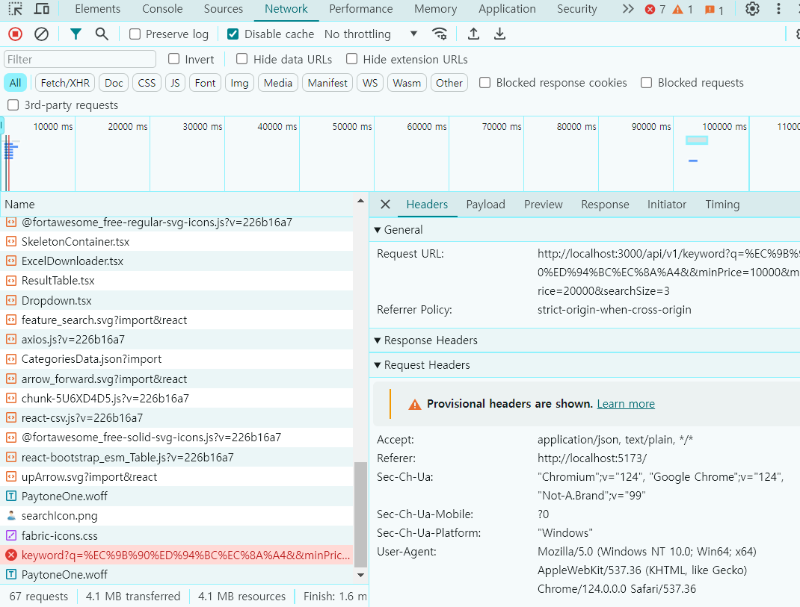
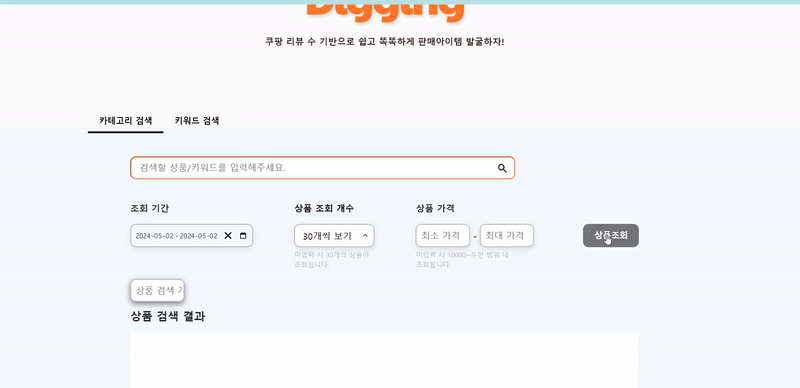
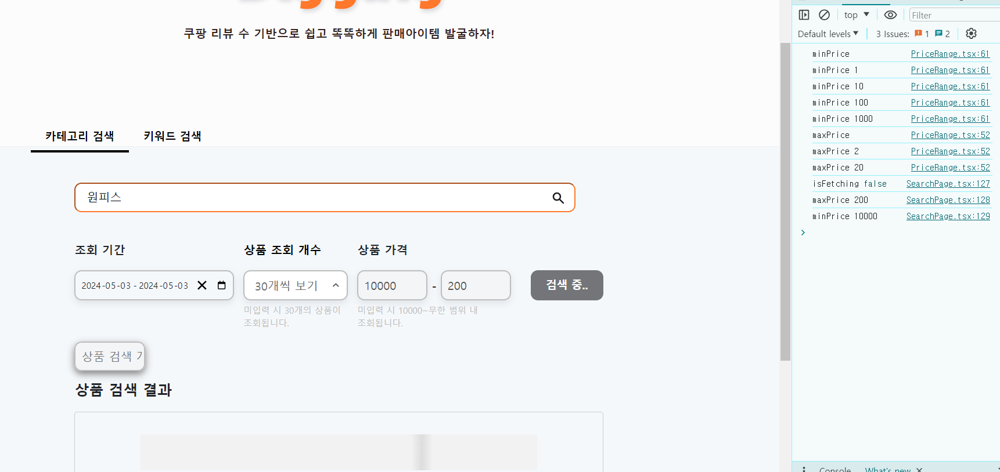
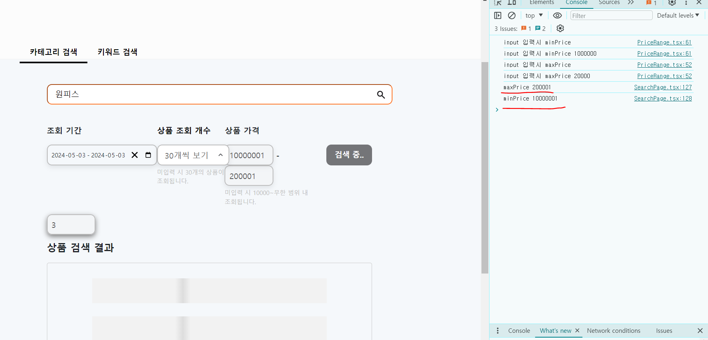
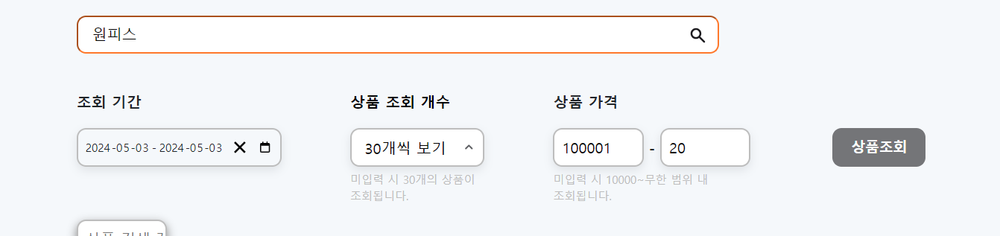
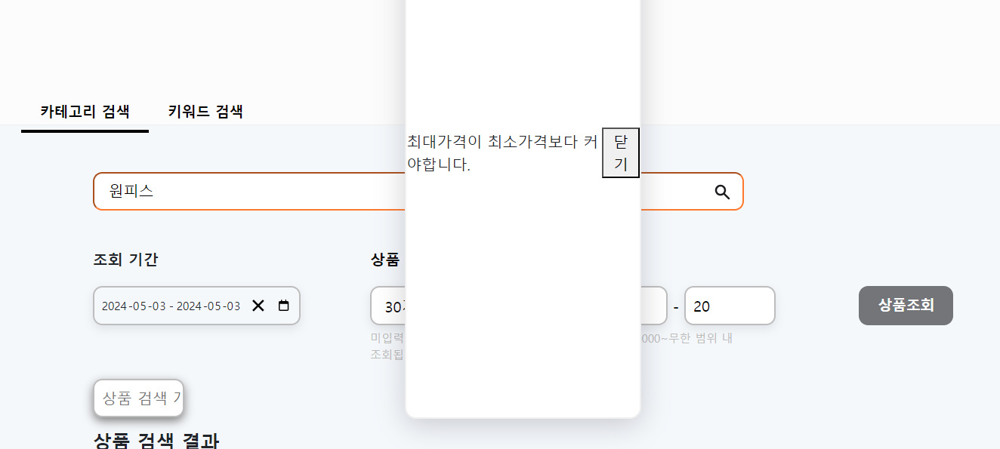

본 프로젝트에서 React-Query를 이용해 api 호출 시 2가지 예외처리가 필요합니다.

1. keyword 미입력 상품 조회 시도
2. 최소가격이 최대가격보다 클 경우

두 경우를 모두 React-Query 내에서 에러 핸들링을 하는 것이 아닌 조건문을 활용해 에러자체가 안나게 하는 방식을 채택했습니다.

# React-Query 에러 핸들링을 사용하지 않은 이유

api를 호출하는 방식을 보시면 그 이유를 아실 수 있습니다.



서버를 꺼놓은 상태에서 api 호출을 시도해보겠습니다. 당연히 에러가 나겠죠?



본 프로젝트는 백엔드 서버가 없는 서버리스로 운영됩니다. (적어도 포스팅하는 지금 당장은 그렇습니다. 차후 서버를 구축할 수도 있긴합니다.)

서버가 없는 대신 api 호출 시 쿠팡페이지 크롤링을 시작하고 수집한 데이터를 프론트단으로 뿌리는 구조입니다.

gif 이미지를 보시면 아시겠지만 서버를 키지않았음에도 불구하고 일단 loading이 이루어집니다. 즉 사용자는 어떤 오류든 일단 loading창을 본 뒤 에러가 났다는 것을 인지히게 됩니다. 이는 사용자 경험 측면에서 좋지 못하다고 판단했습니다.

때문에 크롤링 자체가 안되는게 아닌 사용자가 조건을 잘못입력해서 생긴 에러의 경우 즉각적으로 에러알림을 띄워서 사용자가 바로 수정할 수 있게 설계했습니다.

<br>
<br>

# 모달창 생성

먼저 예외처리 시 띄워줄 모달창을 만들어보겠습니다.

모달창을 만들기 위해 `createPortal` 컴포넌트를 사용했습니다.

```tsx
//ModalContent.tsx

import styled from "styled-components";

const PortalDiv = styled.div`
  display: flex;
  justify-content: space-evenly;
  align-items: center;
  box-shadow: rgba(100, 100, 111, 0.3) 0px 7px 29px 0px;
  background-color: white;
  border: 2px solid rgb(240, 240, 240);
  border-radius: 12px;
  position: absolute;
  width: 250px;
  top: 70px;
  left: calc(50% - 125px);
  bottom: 70px;
`;

export default function ModalContent({ onClose, errorMessage }) {
  return (
    <PortalDiv>
      <div>keyword 값을 입력하세요.</div>
      <button onClick={onClose}>닫기</button>
    </PortalDiv>
  );
}
```

기능구현을 완료한 뒤 ui 제작하려고 일단 공식문서에 있는 코드를 빌려왔습니다.

```tsx

//SearchPage.tsx


export default function SearchPage() {

    //생략..

  const [showModal, setShowModal] = useState(false);


  //생략..

  const handleSearch = () => {
    if (pathName == "") {
      setShowModal(true)
    } else if (maxPrice < minPrice) {
      setShowModal(true);
    } else {
      setResultVisible(true);
      refetch();
    }
  };

  return


//생략..

    <InquiryButton
          disabled={isFetching}
          onClick={() => {
            handleSearch();
            navigate(queryURL);
          }}
        >
          {isFetching ? "검색 중.." : "상품조회"}
        </InquiryButton>


//생략..

{
  showModal &&
    createPortal(
      <ModalContent
        onClose={() => setShowModal(false)}
      />,
      document.body
    );
}

//생략..
```

`handleSearch()` 함수 내부 조건문에 따라 pathname이 공백이거나(keyword값이 비어있거나), 최소값이 최대값보다 크면 modal창을 띄우도록 만들었습니다.



정상적으로 띄워지는 것을 확인할 수 있습니다.

<br>
<br>

# 분기처리를 통한 모달창 메시지 동적처리

두 번째 할 일은 keyword 값이 비어있을 때와 최대가격이 최소가격보다 작을 때 모달창 content 내용이 달라야하는 것입니다.

```tsx
//ModalContent.tsx

export default function ModalContent({ onClose, errorMessage }) {
  return (
    <PortalDiv>
      <div>{errorMessage}</div>
      <button onClick={onClose}>닫기</button>
    </PortalDiv>
  );
}
```

<br>

```tsx
//SearchPage.tsx

const [errorMessage, setErrorMessage] = useState("");

//생략

const handleSearch = () => {
  if (pathName == "") {
    setShowModal(true);
    setErrorMessage("keyword를 입력하세요");
  } else if (maxPrice < minPrice) {
    setErrorMessage("최대가격이 최소가격보다 커야합니다.");
    setShowModal(true);
  } else {
    setResultVisible(true);
    refetch();
  }
};

//생략

{
  showModal &&
    createPortal(
      <ModalContent
        onClose={() => setShowModal(false)}
        errorMessage={errorMessage}
      />,
      document.body
    );
}
```

간단합니다 props에 메시지값을 추가해서 분리처리후 넘겨주는 방식을 채택하면 됩니다.


<br>

인줄 알았는데....



api가 호출되는 참사가 일어났네요 도대체 왜 이러는걸까요.. 분명히 분기처리했는데...

<br>
<br>

하나하나 뜯어봅시다..

```tsx
//SearchPage.tsx

const handleSearch = () => {
  if (pathName == "") {
    setShowModal(true);
    setErrorMessage("keyword를 입력하세요");
  } else if (maxPrice < minPrice) {
    setErrorMessage("최대가격이 최소가격보다 커야합니다.");
    setShowModal(true);
    console.log("분리처리한 maxPrice", maxPrice);
    console.log("분기처리한 minPrice", minPrice);
  } else {
    setResultVisible(true);
    refetch();
    console.log("maxPrice", maxPrice);
    console.log("minPrice", minPrice);
  }
};
```



음 분명

```tsx
else if (maxPrice < minPrice) {
      setErrorMessage('최대가격이 최소가격보다 커야합니다.')
      setShowModal(true);

```

조건문을 줬는데 실행이 안됐습니다.

왜 그런가 했더니...

```tsx
const [maxPrice, setMaxPrice] = useState("");
const [minPrice, setMinPrice] = useState("");
```

네... minPrice, maxPrice 값은 string 타입입니다... number타입이 아니라서 이 사달이 난겁니다..

```tsx
else if(Number(maxPrice) < Number(minPrice))  {
      setErrorMessage('최대가격이 최소가격보다 커야합니다.')
      setShowModal(true);

```

타입 변환 후 다시 호출해봤습니다.






모달창이 정상적으로 호출됩니다!

디자인 ui 작업은 추후 하도록 하겠습니다 ㅎㅎㅎ;;;

