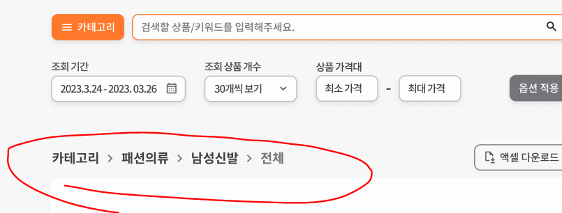

위 사진처럼 상위 카테고리 목록에서 하위 카테고리 목록으로 넘어갈 경우 상위 카테고리에 화살표 아이콘을 고정시키는 로직을 구현해보겠습니다.

<br/>
<br/>

# 로직 구상

모든 로직은 일단 한국어로 구상한 후 시작해야합니다.

1. hover된 컴포넌트 내에서 커서 이동 시 화살표 아이콘 동적 렌더링 (hover된 카테고리 값에만 화살표 아이콘이 렌더링)
2. 컴포넌트 렌더링시 해당 컴포넌트만 화살표 나타나기. (하위 컴포넌트는 화살표 아이콘 없음)
3. 하위 컴포넌트 이동 시 상위 컴포넌트 화살표 아이콘 고정 (상위 카테고리값에 화살표를 고정)

<br>

대충 이 정도 로직을 구현하면 될 것 같습니다.

<br>
<br>

# 구현 과정

## 1. hover된 컴포넌트 내에서 커서 이동 시 화살표 아이콘 동적 렌더링

사실 1번을 구현하면 2번은 자동으로 구현됩니다.

1번 구현방법은 생각보다 어렵지 않습니다.

```tsx
{
  data.firstCategories.map((item, index: number) => {
    return (
      <Category
        key={index}
        onMouseEnter={() => {
          setSelectedSecondCategory(item);
        }}
      >
        <CategoryListLink to={item.categoryId} color="white">
          {item.name}
        </CategoryListLink>
        <StyledArrow_Forward />
      </Category>
    );
  });
}
```

위 코드와 같이 카테고리값 배열을 반복문 돌리는 형태로 구성되어있는데 카테고리값에 hover 시 특정 `state값`을 해당 카테고리값으로 할당하고 state값과 반복문 요소인 `item` 과 일치하면 `<StyledArrow_Forward />` 화살표 아이콘을 렌더링하도록 구현하면 될 것 같습니다.

<br>

```tsx
//생략

const StyledArrow_Forward = styled(Arrow_Forward)<{ show: boolean }>`
  position: absolute;
  top: 0.8rem;
  right: 2.5rem;
  opacity: ${(props) => (props.show ? "1" : "0")};
`;

//생략


export default function CategoryList() {

     const [hoveredFirstCategory, setHoveredFirstCategory] = useState(null);

    //생략

    return

    //생략

  {data.firstCategories.map((item, index: number) => {
            return (
              <Category
                key={index}
                onMouseEnter={() => {
                      setSelectedSecondCategory(item);
                  setHoveredFirstCategory(item);
                }}
              >
                <CategoryListLink
                  to={item.categoryId}
                  color="white"
                >
                  {item.name}
                </CategoryListLink>
                <StyledArrow_Forward show={hoveredFirstCategory === item} />
              </Category>
            );
          })}
```

개별 카테고리값 `<Category>` 에 hover 시 setHoveredFirstCategory 함수를 호출하여 해당 카테고리값을 할당하고 이를 조건으로 해당 카테고리 값과 item이 같으면 화살표 아이콘이 렌더링 되도록 구현하면 됩니다. 1,2번은 해결됐군요.

 <br>
 <br>

## 2. 하위 컴포넌트 이동 시 상위 컴포넌트 화살표 아이콘 고정 (상위 카테고리값에 화살표를 고정)

생각해보니 2번 로직도 자연스럽게 해결되는군요.

상위(1차) 카테고리에서 하위(2차) 카테고리로 이동 시 마지막으로 hover 했던 카테고리 값이 최종 `hoveredFirstCategory` 에 할당됩니다. 즉 다시 해당 카테고리값으로 커서가 이동하지 않는이상 `hoveredFirstCategory` 값은 변하지 않기 때문에 화살표 아이콘도 자연스럽게 고정됩니다.

<br>
<br>

## 3. 하위 -> 상위 카테고리 이동 시 하위 카테고리 화살표 아이콘 제거

끝난 것 같지만 끝나지않았습니다.

마지막으로 하위(2차) 카테고리에서 상위(1차) 카테고리로 커서 이동 시 하위 카테고리 내 화살표 아이콘이 사라지게 하는 로직을 구현해야합니다.

간단합니다. `hoveredSecondCategory`를 null로 초기화하면 됩니다.

```tsx
{
  data.firstCategories.map((item, index: number) => {
    return (
      <Category
        key={index}
        onMouseEnter={() => {
          setSelectedSecondCategory(item);
          setHoveredFirstCategory(item);
          setHoveredSecondCategory(null);
        }}
      >
        <CategoryListLink to={item.categoryId} color="white">
          {item.name}
        </CategoryListLink>
        <StyledArrow_Forward show={hoveredFirstCategory === item} />
      </Category>
    );
  });
}
```

위와 같은 로직으로 2 - 3차 카테고리 로직도 동일하게 구현하면 됩니다.

마지막으로 `hoveredN차Category` 값은 카테고리 data 값이거나 null값이므로 타입설정을 해줘 마무리합니다.

```tsx
const [selectedFirstCategory, setSelectedFirstCategory] =
  useState<CategoryItem | null>(null);
const [selectedSecondCategory, setSelectedSecondCategory] =
  useState<CategoryItem | null>(null);
const [selectedThirdCategory, setSelectedThirdCategory] =
  useState<CategoryItem | null>(null);
```

<br>
<br>
<br>

# 카테고리 클릭시 부모 카테고리 값도 같이 출력 로직 구현

추가로 카테고리 값 선택 시 해당 카테고리의 상위 카테고리값까지 같이 화면에 출력되도록 로직을 구현해보겠습니다.



위 이미지처럼 '남성신발' 카테고리 값을 클릭하면 상위 카테고리인 '패션의류' 까지 출력되도록 말이죠.

<br>

## 로직을 적어보자

마찬가지로 일단 한글로 로직을 적어봅시다.

1. 1차 카테고리 클릭 시 해당 카테고리값만 출력
2. 2,3차 카테고리 클릭 시 해당 카테고리의 상위 카테고리값까지 출력

딱히 쓸 내용이 없군요...

## 1. 화면에 출력할 state 값 3개 필요

일단 클릭시 출력할 1차 카테고리 값 state, 2차 카테고리 값 state, 3차 카테고리 값 state를 생성합니다.

```tsx
const {
  setClickedFirstCategory,
  setClickedSecondCategory,
  setClickedThirdCategory,
} = useOutletContext();
```

state값들은 해당 컴포넌트의 부모 컴포넌트인 SearchPage 에서 출력할 예정이므로 SearchPage 컴포넌트에서 정의한 후 Outlet 컴포넌트 props로 전달해줬습니다.

```tsx


const handleClick = (level: number, category: CategoryItem) => {
    if (level === 1) {
      setClickedFirstCategory(category.name);
      setClickedSecondCategory(null);
      setClickedThirdCategory(null);
      setSelectedCategoryId(category.categoryId);
    } else if (level === 2) {
      if (selectedSecondCategory !== null) {
        setClickedFirstCategory(selectedSecondCategory.name);
        setClickedSecondCategory(category.name);
        setClickedThirdCategory(null);
        setSelectedCategoryId(category.categoryId);
      }
    } else if (level === 3) {
      if (selectedThirdCategory !== null && selectedSecondCategory !== null) {
        setClickedFirstCategory(selectedSecondCategory.name);
        setClickedSecondCategory(selectedThirdCategory.name);
        setClickedThirdCategory(category.name);
        setSelectedCategoryId(category.categoryId);
      }
    }
  };

//생략

   {data.firstCategories.map((item, index: number) => {
            return (
              <Category
                key={index}
                onMouseEnter={() => {
                  setSelectedSecondCategory(item);
                  setHoveredFirstCategory(item);
                  setHoveredSecondCategory(null);
                }}
              >
                <CategoryListLink
                  to={item.categoryId}
                  onClick={() => {
                    closeEveryCategoryField();
                    handleClick(1, item);
                  }}
                  color="white"
                >
                  {item.name}
                </CategoryListLink>
                <StyledArrow_Forward show={hoveredFirstCategory === item} />
              </Category>
            );
          })}

          //생략


    {selectedSecondCategory?.secondCategories?.map(
            (item, index: number) => {
              return (
                <Category
                  key={index}
                  onMouseEnter={() => {
                    setSelectedThirdCategory(item);
                    setHoveredSecondCategory(item);
                  }}
                  onMouseLeave={() => {
                    if (!selectedThirdCategory) {
                      setHoveredSecondCategory(null);
                    }
                  }}
                >
                  <CategoryListLink
                    to={item.categoryId}
                    onClick={() => {
                      closeEveryCategoryField();
                      handleClick(2, item);
                    }}
                    color="black"
                  >
                    {item.name}
                  </CategoryListLink>
                  <StyledArrow_Forward show={hoveredSecondCategory === item} />
                </Category>
              );
            }
          )}


//생략


  {selectedThirdCategory?.thirdCategories?.map(
            (item, index: number) => {
              return (
                <Category
                  key={index}
                  onMouseEnter={() => setHoveredThirdCategory(index)}
                  onMouseLeave={() => {
                    setHoveredThirdCategory(null);
                  }}
                >
                  <CategoryListLink
                    onClick={() => {
                      closeEveryCategoryField();
                      handleClick(3, item);
                    }}
                    to={item.categoryId}
                    color="black"
                  >
                    {item.name}
                  </CategoryListLink>

                  <StyledArrow_Forward show={hoveredThirdCategory === index} />
                </Category>
              );
            }
          )}

```

다음과 같이 로직을 구현하면 됩니다.

각각 카테고리마다 레벨을 설정해줍니다. `handleClick` 함수 호출 시 레벨과 해당 카테고리값을 파라미터로 넘겨줍니다. 1차 카테고리 클릭 시 1, 2차 카테고리 클릭 시 2, 3차 카테고리 클릭 시 3을 넣어줍니다.

`handleClick` 함수 호출 시 

```tsx
 setClickedFirstCategory()
  setClickedSecondCategory()
  setClickedThirdCategory()
  ```

  3개의 setState함수가 호출되면서 각각 값을 할당합니다.

  1차 카테고리 값을 클릭했다면 1차만 값이 할당되고 2,3차는 null값이 됩니다. 
  2차 카테고리 값을 클릭했다면 1,2차만 값이 할당되고 3차는 null값이 됩니다. 
  3차 카테고리 값을 클릭했다면 1,2,3차만 값 모두 할당됩니다.

  <br>

  마지막으로 `selectedCategoryId` 함수는 카테고리 값 클릭 시 해당 카테고리의 id값을 저장합니다.

  url pathname과 해당 카테고리 id값이 일치해야하기 때문이죠.

  ```tsx

//SearchPage.tsx

   {selectedCategoryId == pathname.split("/")[2] && (
        <div>
          {clickedFirstCategory && (
            <SelectedCategory>{clickedFirstCategory}</SelectedCategory>
          )}
          {clickedSecondCategory && (
            <SelectedCategory>
              {" "}
              {">"} {clickedSecondCategory}
            </SelectedCategory>
          )}
          {clickedThirdCategory && (
            <SelectedCategory>
              {" "}
              {">"} {clickedThirdCategory}
            </SelectedCategory>
          )}
        </div>
      )}

  ```

  다음과 같이 로직을 구현하면 됩니다.


<br>
<br>
<br>

<details>

<summary>참고문헌</summary>

<div markdown="1">

오로지 마이 브레인

</div>

</details>
