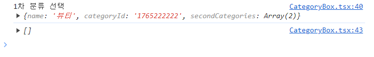

# 카테고리 분류 드롭박스 구현

```json
//카테고리 제공 api 더미데이터

{
  "firstCategories": [
    {
      "name": "뷰티",
      "categoryId": "1765222222",
      "secondCategories": [
        {
          "name": "스킨케어",
          "categoryId": "1765311111",
          "thirdCategories": [
            {
              "name": "스킨",
              "categoryId": "1765580"
            },
            {
              "name": "로션",
              "categoryId": "1713661530"
            },
            {
              "name": "에센스/세럼/엠플",
              "categoryId": "176511730"
            }
          ]
        },

        {
          "name": "클린/비건뷰티",
          "categoryId": "509357431193",
          "thirdCategories": [
            {
              "name": "클렌징",
              "categoryId": "17654121124330"
            },
            {
              "name": "바디워시",
              "categoryId": "1712365123130"
            },
            {
              "name": "샴푸",
              "categoryId": "176y690345645530"
            }
          ]
        }
      ]
    },
    {
      "name": "전자제품",
      "categoryId": "17642451522",
      "secondCategories": [
        {
          "name": "노트북",
          "categoryId": "1765343310",
          "thirdCategories": [
            {
              "name": "맥북",
              "categoryId": "1715851216530"
            },
            {
              "name": "삼성",
              "categoryId": "176539046340"
            },
            {
              "name": "그램",
              "categoryId": "173317615530"
            }
          ]
        },
        {
          "name": "핸드폰",
          "categoryId": "5093125293",
          "thirdCategories": [
            {
              "name": "갤럭시",
              "categoryId": "1764631530"
            },
            {
              "name": "아이폰",
              "categoryId": "1765341130"
            },
            {
              "name": "샤오미",
              "categoryId": "1765423354130"
            }
          ]
        }
      ]
    }
  ]
}
```

# 기본적 동작 플로우

1. 1차 분류 버튼 클릭 시 firstCategories배열 요소의 name들이 드롭 다운 박스로 출력
2. 1차 분류 버튼 **드롭 다운 리스트 요소** 클릭 시 1차 분류 버튼 value 값이 **클릭한 요소**로 변환
3. 2차 분류 버튼 클릭 시 1차 버튼에서 클릭했던 요소의 secondCategories 배열 요소의 name들이 드롭 다운 박스로 출력
4. 2차 분류 버튼 **드롭 다운 리스트에서 요소** 클릭 시 2차 분류 버튼 value 값이 **클릭한 요소**로 변환
5. 3차 분류 버튼 클릭 시 2차 분류 버튼에서 클릭했던 요소의 thridCategories 배열 요소의 name들이 드롭 다운 박스로 출력
6. 3차 분류 버튼 **드롭 다운 리스트에서 요소** 클릭 시 3차 분류 버튼 value 값이 **클릭한 요소**로 변환

# 추가 기능구현 리스트

1. 1차 분류 선택 전 2,3차 분류 선택 불가능 구현
2. 1,2,3차 모두 선택 후 1차 선택 변경 시 2,3,차 카테고리 초기화
   2차 선택 변경 시 1차 유지, 3차는 초기화
   → 이전 카테고리 선택 시 이후 카테고리는 모두 초기화
3. params로 더미데이터 상품 id값을 가져와 라우팅 작업

# 구현 시 유의사항 및 방법

1. 1차,2차,3차 분류 버튼 드롭박스 리스트 값들을 보관할 배열 필요.
2. 드롭다운 요소를 클릭했을 경우 배열이 생성되도록 해야함. 미리 생성하면 성능 및 효율 이슈. ~~즉 콜백함수 활용~~ → 리팩토링 시 고려
3. 1차선택 시~ 2차 선택시~ 조건이 생기므로 if문을 활용
4. ~~콜백지옥에 빠질 수 있기 때문에 promise나 다른거 써야한다.~~
   써야하는진 모르겠지만 일단 기능구현에 초점을 맞춤. 리팩토링은 차후 생각

## 카테고리 선택 기능 구현 완료 코드

```js
import Dropdown from "react-bootstrap/Dropdown";

import { useEffect, useState } from "react";

import data from "../../../../public/dummyData/CategoryList.json";

export default function CategoryBox() {
  const list = data.firstCategories;
  const firCateList = [];
  const [secCateList, setSecCateList] = useState([]);
  const [thrCateList, setThrCateList] = useState([]);
  //3차 카테고리 드롭박스 리스트

  const [isSecCateDisabled, setIsSecCateDisabled] = useState(true);
  //2차 카테고리 드롭박스 활성/비활성 토글
  const [isThrCateDisabled, setIsThrCateDisabled] = useState(true);
  //3차 카테고리 드롭박스 활성/비활성 토글

  const [firCateTitle, setFirCateTitle] = useState("1차분류");
  //1차 카테고리 드롭박스 선택 명시될 name 값

  const [secCategoryTitle, setSecCategoryTitle] = useState("2차분류");
  //2차 카테고리 드롭박스 선택 명시될 name 값

  const [thrCategoryTitle, setThrCategoryTitle] = useState("3차분류");
  //3차 카테고리 드롭박스 선택 명시될 name 값

  //컴포넌트 렌더링 시 1차 분류 드롭박스 배열에 데이터 삽입
  list.forEach((item) => {
    firCateList.push(item.name);
  });

  //3차 분류 드롭박스 클릭 시 동작
  const thrDropdownSelecthandle = (eventKey) => {
    setThrCategoryTitle(eventKey);
  };

  //2차 분류 드롭박스 클릭 시 동작
  const secDropdownSelecthandle = (eventKey) => {
    setSecCategoryTitle(eventKey);
    const List = secCateList.find((item) => item.name == eventKey);
    //선택한 2차 드롭박스 name과 더미데이터 프로퍼티 name과 일치하는 객체 추출
    console.log("2차 분류 선택 ", List);
    setIsThrCateDisabled(false);
    setThrCateList((prev) => (prev = List.thirdCategories));
    console.log(thrCateList);
  };

  const firDropdownSelecthandle = (eventKey) => {
    setFirCateTitle(eventKey);
    const List = list.find((item) => item.name == eventKey);
    console.log("1차 분류 선택 ", List);
    //선택한 1차 드롭박스 name과 더미데이터 프로퍼티 name과 일치하는 객체 추출
    setIsSecCateDisabled(false);
    setSecCateList((prev) => (prev = List.secondCategories));
    console.log(secCateList);
  };

  return (
    <>
      <div>
        <div>
          <Dropdown onSelect={firDropdownSelecthandle}>
            <Dropdown.Toggle variant="" id="dropdown-basic">
              {firCateTitle}
            </Dropdown.Toggle>
            <Dropdown.Menu>
              {firCateList.map((item, idx) => {
                return (
                  <Dropdown.Item eventKey={item} key={idx}>
                    {item}
                  </Dropdown.Item>
                );
              })}
            </Dropdown.Menu>
          </Dropdown>
        </div>
        <div>
          <Dropdown onSelect={secDropdownSelecthandle}>
            <Dropdown.Toggle
              variant=""
              id="dropdown-basic"
              disabled={isSecCateDisabled}
            >
              {secCategoryTitle}
            </Dropdown.Toggle>

            <Dropdown.Menu>
              {secCateList.map((item, idx) => {
                return (
                  <Dropdown.Item eventKey={item.name} key={idx}>
                    {item.name}
                  </Dropdown.Item>
                  //href 값 넣을 수 있음
                );
              })}
            </Dropdown.Menu>
          </Dropdown>
        </div>
        <div>
          <Dropdown onSelect={thrDropdownSelecthandle}>
            <Dropdown.Toggle
              variant=""
              id="dropdown-basic"
              disabled={isThrCateDisabled}
            >
              {thrCategoryTitle}
            </Dropdown.Toggle>
            <Dropdown.Menu>
              {thrCateList.map((item, idx) => {
                return (
                  <Dropdown.Item eventKey={item.name} key={idx}>
                    {item.name}
                  </Dropdown.Item>
                );
              })}
            </Dropdown.Menu>
          </Dropdown>
        </div>
      </div>
    </>
  );
}
```


구현 성공

# 트러블슈팅

<details>

<summary>하이픈(-)을 포함하는 객체 프로퍼티 명 접근 이슈</summary>

<div markdown="1">

```jsx
const data = {
  "first-categories": [
    {
      name: "뷰티",
      "category-id": "176522",
      "second-categories": [
        {
          name: "스킨케어",
          "category-id": "176530",
          "third-categories": [
            {
              name: "스킨",
              "category-id": "176530",
            },
            {
              name: "로션",
              "category-id": "176530",
            },
            {
              name: "에센스/세럼/엠플",
              "category-id": "176530",
            },
          ],
        },
        {
          name: "클린/비건뷰티",
          "category-id": "509393",
          "third-categories": [
            {
              name: "스킨",
              "category-id": "176530",
            },
          ],
        },
      ],
    },
    {
      name: "뷰티/섹시/쿨",
      "category-id": "176522",
      subcategories: [
        {
          name: "스킨케어",
          "category-id": "176530",
          "third-categories": [
            {
              name: "스킨",
              "category-id": "176530",
            },
            {
              name: "로션",
              "category-id": "176530",
            },
            {
              name: "에센스/세럼/엠플",
              "category-id": "176530",
            },
          ],
        },
        {
          name: "클린/비건뷰티",
          "category-id": "509393",
          "third-categories": [
            {
              name: "스킨",
              "category-id": "176530",
            },
          ],
        },
      ],
    },
  ],
};

console.log(data.first - categories);
//"SyntaxError: Unexpected token '-'
//at https://static.jsbin.com/js/prod/runner-4.1.8.min.js:1:13924
//at https://static.jsbin.com/js/prod/runner-4.1.8.min.js:1:10866"
```

객체 프로퍼티 명에 하이픈(-)이 포함되었기 때문에 접근할 수 없다는 에러가 떴다.

백엔드와 소통이 필요할 듯 하다.

→ 프로퍼티 작명 카멜표기법으로 합의!

</div>

</details>

<details>

<summary>setState함수 비동기성 동작 이슈</summary>

<div markdown="1">

```jsx
//1차 분류 선택 시 실행될함수

const firstDropdownSelecthandle = (eventKey) => {
  setFirstCategoryTitle(eventKey);
  const List = list.find((item) => item.name == eventKey);
  console.log("1차 분류 선택 ", List);
  setIsSecCateDisabled(false);
  setSecCateList(List.secondCategories);
  console.log(secCateList);
};
```

## 동작 플로우

1. eventKey값을 받아와 FirstCategoryTitle state에 할당
2. 받아온 eventKey값과 더미데이터(list) 프로퍼티 name과 일치하는 객체를 찾은 뒤 List 변수에 할당
3. List 객체 내 존재하는 secondCategories 프로퍼티 배열을 불러온 후 setState 함수를 이용해 SecCateList에 할당
4. 2차, 3차 드롭박스도 반복

하려했지만

</img>

console.log(secCateList) 값은 빈 객체를 반환.

원인은 setState 함수의 비동기성

setState 함수에 의해 state에 값이 할당되려면 시간이 걸린다. 근데 react 그 시간을 기다려주지않고 바로 다음 코드를 읽어버린다.

즉

```jsx
setSecCateList(List.secondCategories);
//값이 할당되는데 시간이 걸리....

//안기다리고 바로 다음코드를 읽어버림
console.log(secCateList);
//secCateList state에 아직 List.secondCategories 값이 안들어온 상태
//하지만 console.log()실행
//빈 객체 반환
```

이를 해결하기 위해선 setState 함수를 동기적으로 동작하도록 함수형 업데이트 구조로 구현해야한다.

```jsx
setSecCateList((prev) => (prev = List.secondCategories));
```

다음과 같이 코드를 수정하니

</img>

성공했다!

</div>

</details>

<details>

<summary>a태그 중첩 이슈</summary>

<div markdown="1">

```jsx
<Dropdown.Item eventKey={item.name} key={idx} href={item.categoryId}>
  <Link to={item.categoryId}>{item.name}</Link>
</Dropdown.Item>
```

Link 컴포넌트를 카테고리 버튼 컴포넌트로 감싸니

```jsx
validateDOMNesting(...): <a> cannot appear as a descendant of <a>.
```

다음고 같은 에러가 났다.

**a태그'는 'a태그'의 하위 항목으로 나타날 수 없습니다**

라는 뜻이다.

즉 <Dropdown.Item> 컴포넌트는 a태그 역할을 한다.

때문에 a태그 안에 a태그 역할인 Link 컴포넌트를 넣어서 에러가 발생한 것이다.

렌더링은 되지만 성능이슈가 생길 수 있으므로 해결해야할 문제이다.

</img>

Link 컴포넌트로 라우팅 설정하니까 저모양으로 주소설정됐다. 아싸리 이렇게 설계하면 안된다.

</div>

</details>
