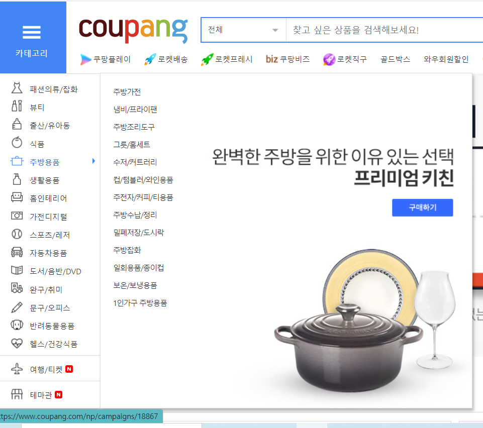
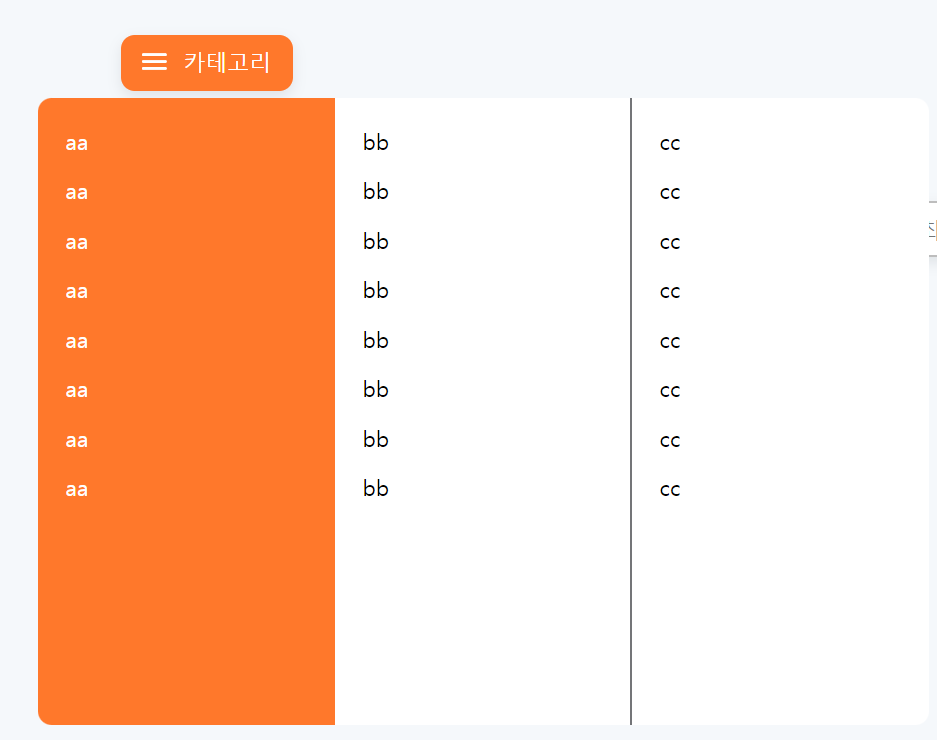
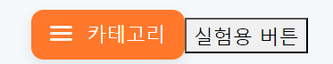
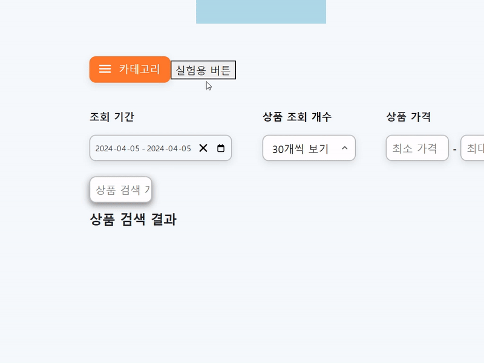
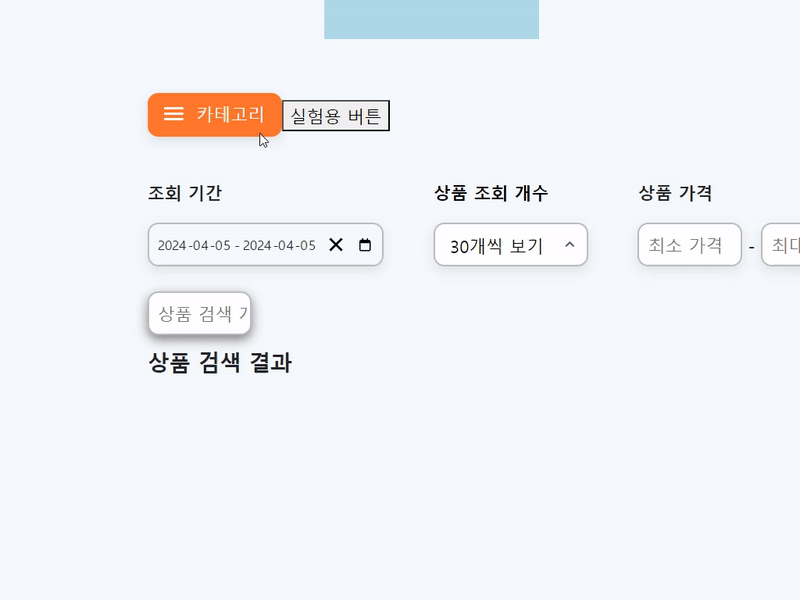

카테고리 컨테이너를 만들어보겠습니다.

레퍼런스는 쿠팡을 참고했습니다.




위 사진처럼 카테고리에 hover 시 1차 카테고리 분류 박스 렌더링

1차 카테고리 분류 hover 시 2차 카테고리 분류 박스 렌더링

2차 카테고리 분류 hover 시 3차 카테고리 분류 박스 렌더링

이 되도록 구현해야합니다.

그리고 카테고리에 hover 시 이전 카테고리 분류박스는 그대로 렌더링 되는 상태여야합니다.



기본 ui입니다. 매우 구리지만 차차 이쁘게 만들어가도록 합시다.

간략한 코드 구조입니다.

```tsx

//CategoryList.tsx

import styled from "styled-components";
import data from "dummyData/CategoriesData.json";
import { useState } from "react";

const CategoriesContainer = styled.div`
  width: 216px;
  margin-top: 5px;
  z-index: 2;
  height: 456px;
  left: ${(props) => props.left};
  background-color: ${(props) => props.backgroundColor};
  border-radius: ${(props) => props.borderRadius};
  border-right: ${(props) => props.borderRight};
  padding: 12px 0px 12px 12px;
  position: absolute;

`;

const CategoriesListBox = styled.div`
  display: flex;
  flex-direction: column;
`;

const Category = styled.div`
  width: 100%;
  height: 36px;
  padding: 7px 8px;
  &:hover {
    background-color: white;
    p {
      color: var(--Orange500);
    }
  }
`;

const CategoryTitle = styled.p`
  color: ${(props) => props.color};
  font-size: var(--font-size-primary);
`;

export default function CategoryList() {

  const List1 = ["aa", "aa", "aa", "aa", "aa", "aa", "aa", "aa"];
  const List2 = ["bb", "bb", "bb", "bb", "bb", "bb", "bb", "bb"];
  const List3 = ["cc", "cc", "cc", "cc", "cc", "cc", "cc", "cc"];
  return (
    <>
 
      <CategoriesContainer
        backgroundColor="var(--Orange500);"
        borderRadius="10px 0px 0px 10px"
        borderRight="none"
        left="216px"
     
      >
        <CategoriesListBox>
          {List1.map((item, idx) => {
            return (
              <Category key={idx}>
                <CategoryTitle color="white">{item}</CategoryTitle>
              </Category>
            );
          })}
        </CategoriesListBox>
      </CategoriesContainer>
      <CategoriesContainer
        backgroundColor="white"
        borderRadius="0px"
        borderRight="2px solid var(--Gray700)"
        left="432px"
    
      >
        {" "}
        <CategoriesListBox>
          {List2.map((item, idx) => {
            return (
              <Category key={idx}>
                <CategoryTitle color="black">{item}</CategoryTitle>
              </Category>
            );
          })}
        </CategoriesListBox>
      </CategoriesContainer>
      <CategoriesContainer
        backgroundColor="white"
        borderRight="none"
        borderRadius="0px 10px 10px 0px"
        left="648px"
  
      >
        {" "}
        <CategoriesListBox>
          {List3.map((item, idx) => {
            return (
              <Category key={idx}>
                <CategoryTitle color="black">{item}</CategoryTitle>
              </Category>
            );
          })}
        </CategoriesListBox>
      </CategoriesContainer>
    </>
  );
}

```

```tsx
//CategoryContainer.tsx

import Button from "components/common/Button";
import CategoryList from "./CategoryList";

export default function CategoryContainer() {

  return (
    <>
      <Button
        title="카테고리"
        BackGroundColor="var(--Orange500)"
        color="white"
        borderColor="var(--Orange500)"
      />
      <CategoryList/>
    </>
  );
}

```

# 1. 카테고리버튼 hover 시 1차 카테고리list 렌더링



일단 버튼을 하나 만들었습니다.

왜 느닷없이 버튼을 만들었냐 물으신다면 카테고리 컴포넌트에 onmouseenter 함수가 동작하지 않았기 때문입니다… 일단 이 문제는 차치하고 카테고리 목록 컴포넌트를 만든 후 해결하도록 하겠습니다.

```tsx
  
  
  //CategoryList.tsx
  
  const CategoriesContainer = styled.div`
  width: 216px;
  margin-top: 5px;
  z-index: 2;
  height: 456px;
  left: ${(props) => props.left};
  background-color: ${(props) => props.backgroundColor};
  border-radius: ${(props) => props.borderRadius};
  border-right: ${(props) => props.borderRight};
  padding: 12px 0px 12px 12px;
  position: absolute;
  
  visibility: ${(props) => (props.isVisible ? "visible" : "hidden")};
  opacity: ${(props) => (props.isVisible ? "1" : "0")};
  transition: visibility 0.3s ease, opacity 0.3s ease;
  //onmouseenter 속성으로 컴포넌트의 렌더링 비렌더링을 분기해줬습니다. 
  
`;

  
export default function CategoryList() {
  const [isHovered, setIsHovered] = useState(false);
  //hover 유무를 판단하는 state 입니다. 
  
  const List1 = ["aa", "aa", "aa", "aa", "aa", "aa", "aa", "aa"];
  const List2 = ["bb", "bb", "bb", "bb", "bb", "bb", "bb", "bb"];
  const List3 = ["cc", "cc", "cc", "cc", "cc", "cc", "cc", "cc"];
  return (
    <>
      <button
        onMouseEnter={() => setIsHovered(true)}
        {/* 버튼에 hover 하면 state값이 true가 되고 1차 카테고리 컴포넌트가 렌더링됩니다.  */}
        onMouseLeave={() => setIsHovered(false)}
         {/* 버튼에 커서가 벗어나면 state값이 false가 되고 1차 카테고리 컴포넌트가 사라집니다*/}
      >
        실험용 버튼
      </button>
      <CategoriesContainer
        backgroundColor="var(--Orange500);"
        borderRadius="10px 0px 0px 10px"
        borderRight="none"
        left="216px"
        isVisible={isHovered}
      >
        <CategoriesListBox>
          {List1.map((item, idx) => {
            return (
              <Category key={idx}>
                <CategoryTitle color="white">{item}</CategoryTitle>
              </Category>
            );
          })}
        </CategoriesListBox>
      </CategoriesContainer>
  

```

정상적으로 렌더링 됩니다.



# 2. 1차 컴포넌트 hover 시 2차 컴포넌트 렌더링 (3차 컴포넌트도 같은 방법)

위 방법과 동일하지만 각 카테고리 컴포넌트에 독립적인 함수와 invisible 객체를 넣어줘야합니다.

```tsx

export default function CategoryList() {
  const [firstIsHovered, setFirstIsHovered] = useState(false);
  //1차 카테고리 컴포넌트 렌더링 관여
  const [secondIsHovered, setSecondIsHovered] = useState(false);
    //2차 카테고리 컴포넌트 렌더링 관여
  const [thirdIsHovered, setThirdIsHovered] = useState(false);
    //3차 카테고리 컴포넌트 렌더링 관여
  const List1 = ["aa", "aa", "aa", "aa", "aa", "aa", "aa", "aa"];
  const List2 = ["bb", "bb", "bb", "bb", "bb", "bb", "bb", "bb"];
  const List3 = ["cc", "cc", "cc", "cc", "cc", "cc", "cc", "cc"];
  return (
    <>
      <button
        onMouseEnter={() => setFirstIsHovered(true)}
        // onMouseLeave={() => setIsHovered(false)}
      >
        실험용 버튼
      </button>
      <CategoriesContainer
        backgroundColor="var(--Orange500);"
        borderRadius="10px 0px 0px 10px"
        borderRight="none"
        left="216px"
        isVisible={firstIsHovered}
        onMouseEnter={() => setSecondIsHovered(true)}
        
        {/*  1차컴포넌트 hover 시 2차 컴포넌트 렌더링  */}
        
      >
        <CategoriesListBox>
          {List1.map((item, idx) => {
            return (
              <Category key={idx}>
                <CategoryTitle color="white">{item}</CategoryTitle>
              </Category>
            );
          })}
        </CategoriesListBox>
      </CategoriesContainer>
      <CategoriesContainer
        backgroundColor="white"
        borderRadius="0px"
        borderRight="2px solid var(--Gray700)"
        left="432px"
        isVisible={secondIsHovered}
        onMouseEnter={() => setThirdIsHovered(true)}
           {/*  2차컴포넌트 hover 시 3차 컴포넌트 렌더링  */}
      >
        {" "}
        <CategoriesListBox>
          {List2.map((item, idx) => {
            return (
              <Category key={idx}>
                <CategoryTitle color="black">{item}</CategoryTitle>
              </Category>
            );
          })}
        </CategoriesListBox>
      </CategoriesContainer>
      <CategoriesContainer
        backgroundColor="white"
        borderRight="none"
        borderRadius="0px 10px 10px 0px"
        left="648px"
        isVisible={thirdIsHovered}
  
      >
        {" "}
        <CategoriesListBox>
          {List3.map((item, idx) => {
            return (
              <Category key={idx}>
                <CategoryTitle color="black">{item}</CategoryTitle>
              </Category>
            );
          })}
        </CategoriesListBox>
      </CategoriesContainer>
    </>
  );
}
```

 



정상적으로 렌더링 됩니다.