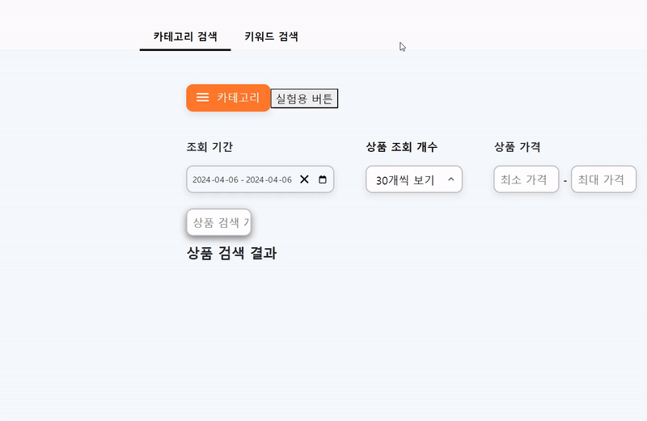
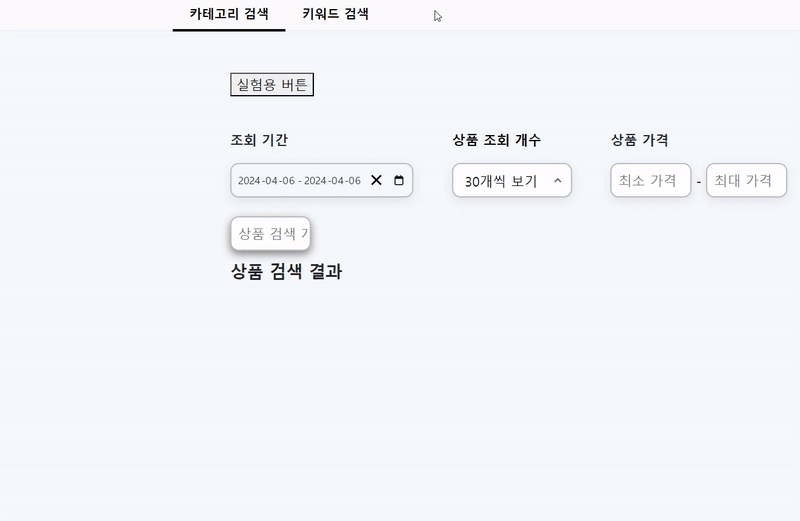
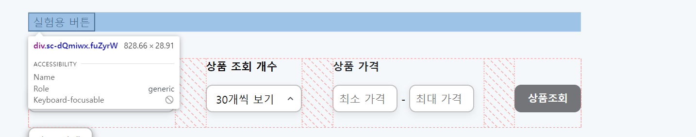
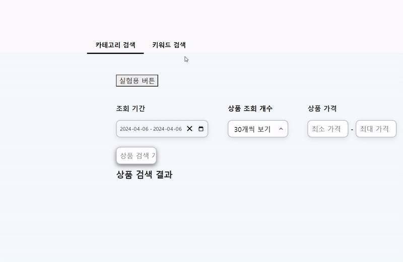

카테고리 컴포넌트 만들기 3탄입니다. 부디 마지막이 되길 바라며 포스팅을 시작하겠습니다.


위 gif를 보시면 3차 카테고리 hover 중 1차 카테고리로 마우스 커서를 이동하면 3차 카테고리 필드가 사라지는 것을 확인할 수 있습니다. 이 기능을 구현하겠습니다.

매커니즘은 생각보다 간단했습니다. 1차 카테고리 필드 hover 시 3차 카테고리 컴포넌트의 visible 속성을 hidden으로 바꿔주면 됩니다.

```tsx
//생략

const secondCateFieldOpen = () => {
  setSecondIsHovered(true);
  if (thirdCategory.length > 0) {
    setThirdIsHovered(false);
  }
};
//생략

return;

//생략

<CategoriesContainer
  backgroundColor="var(--Orange500)"
  borderRadius="10px 0px 0px 10px"
  borderRight="none"
  left="216px"
  isVisible={firstIsHovered}
  onMouseEnter={() => secondCateFieldOpen()}
>
  {data.firstCategories.map((item, index) => {
    return (
      <Category key={index}>
        <CategoryTitle
          onMouseEnter={() => secondCateSelectHandler(index)}
          color="white"
        >
          {item.name}
        </CategoryTitle>
      </Category>
    );
  })}
</CategoriesContainer>;

//생략
```

`secondCateFieldOpen` 이라는 함수를 만들어줬는데 주의할 점은 1차 카테고리 최초 hover 시 3차 카테고리 배열 객체는 생성되지 않은 상태입니다. 때문에 3차 카테고리 배열이 존재할 때 즉 3차 카테고리 필드까지 hover 된 이후 다시 1차 카테고리 필드로 마우스를 hover 했을 때 이 함수가 실행되어야 합니다.

3차 카테고리 배열요소가 존재하는지 확인하기 위해서 `thirdCategory.length` > 0 조건을 주고 함수가 실행되도록 했습니다.



잘 동작합니다. 뿌듯하네요.

하지만 아직 갈길이 멉니다.

진짜 마지막으로 필요한 기능은 마우스가 카테고리 필드를 벗어나면 카테고리 필드들이 닫혀야하는 것입니다.

# 경우의 수

- 카테고리 필드를 벗어나면 모든 카테고리 필드가 닫힌다.

1. 카테고리 첫 버튼 진입시 1차 카테고리 생성, 이 상태에서 버튼 이탈 시 1차 카테고리 사라짐
2. 카테고리 버튼 진입 후 1차 카테고리 진입 시 2차 카테고리 생성 그 이후
   1. 1차 카테고리 상주 시 아무 일도 안생김 (2차 카테고리 목록만 바뀜)
   2. 다시 버튼 진입 시 2차 카테고리 사라짐
   3. 카테고리 필드를 벗어나면 1,2차 카테고리 모두 사라짐
3. 2차 카테고리 진입 시 3차 카테고리 생성 그 이후
   1. 2차 카테고리 상주 시 아무 일도 안생김(3차 카테고리 목록만 바뀜)
   2. 카테고리 필드를 벗어나면 1,2,3차 카테고리 필드 모두 사라짐
   3. ~~1차 카테고리 진입 시 3차 카테고리 필드 사라짐(구현 완료)~~
4. 참고로 모든 마우스 경로는 카테고리 버튼 ↔ 1차 카테고리 ↔ 2차 카테고리 ↔ 3차 카테고리 순으로 이동한다. 1차에서 3차로 바로 이동하는 경우는 존재하지 않는다. 왜냐햐면 위 서술한 경로 이외의 루트로 마우스 이동 시 카테고리 필드를 무조건 벗어나기 때문에 모든 카테고리가 화면에서 사라진다.

위 조건을 만족하는 플로우를 짜주면 될 것 같습니다.

음… 머리가 터질 것 같지만 하나하나 만들어봅시다.

생각해보니 위 플로우보다 더 디테일한 조건이 필요한 것 같습니다.

> 참고로 여기서 부터 `CategoriesContainer` 컴포넌트 이름이 `ClassifiedCategoriesField` 로 바뀌었습니다.

## 카테고리 첫 버튼 진입시 1차 카테고리 생성, 이 상태에서 버튼 이탈 시 1차 카테고리 사라짐

카테고리 버튼에 진입하면 생기는 일을 생각해봅시다. 일단 1차 카테고리가 생성됩니다. 그리고 2,3차 카테고리 배열객체는 없는 상태입니다.

### 이 상태에서 버튼 이탈 시 1차 카테고리 사라짐

의 기능을 구현해봅시다. onmouseleave 속성을 사용하면 됩니다. 근데 **이 상태** 라는 것은 1차 카테고리만 있고 2,3,차 카테고리는 없는 상태입니다. 즉 2차 카테고리 배열 객체가 존재하는가? 의 조건을 부여해서 함수를 완성시켜봅시다.

```tsx
const leaveCategoryButton = () => {
  if (secondCategory.length == 0) {
    setFirstIsHovered(false);
  }
};
```

2차 카테고리 배열 객체 요소 존재 유무에 따라 함수가 동작하도록 설정했습니다.


..?? 버튼과 컴포넌트 사이에 간격이 있어서 생긴 문제입니다..

각 컴포넌트와 버튼을 서로 살짝 씩 겹치게 위치를 조정해줍니다.

`<CategoryContainer>` 라는 모든 카테고리 컴포넌트들을 감싸는 부모 div박스에 relative 속성을 준 뒤 각 카테고리 컴포넌트마다 absolute를 주고 위치를 조정해줬습니다.

하지만 겹친 뒤에도 위 gif파일처럼 동작하더군요. 문제는 전혀 해결되지 않았습니다.

인터넷을 좀 뒤져보니

부모컴포넌트에 `onmouseOver` 라는 속성을 주면 자식 컴포넌트에도 `onmouseOver`에 설정한 함수가 동작한다는군요.

이 방법을 이용해서 버튼 컴포넌트에 1차 카테고리 컴포넌트를 자식컴포넌트로 넣어줬습니다.

```tsx
<ButtonBox
  onMouseOver={() => setFirstIsHovered(true)}
  onMouseLeave={() => leaveCategoryButton()}
>
  <button>실험용 버튼</button>
  <ClassifiedCategoriesField
    backgroundColor="var(--Orange500)"
    borderRadius="10px 0px 0px 10px"
    borderRight="none"
    left="0px"
    isVisible={firstIsHovered}
    onMouseEnter={() => secondCateFieldOpen()}
  >
    {data.firstCategories.map((item, index) => {
      return (
        <Category key={index}>
          <CategoryTitle
            onMouseEnter={() => secondCateSelectHandler(index)}
            color="white"
          >
            {item.name}
          </CategoryTitle>
        </Category>
      );
    })}
  </ClassifiedCategoriesField>
</ButtonBox>
```

그리고 버튼 + 1,2,3차 카테고리 컴포넌트를 모두 묶은 부모 컴포넌트에 `onMouseLeave` 속성을 넣어 컴포넌트 이탈 시 모든 컴포넌트가 사라지도록 세팅했습니다.


아주 잘 동작합니다!!

```tsx


  const secondCateFieldOpen = () => {
    setSecondIsHovered(true);
    if (thirdCategory.length > 0) {
      setThirdIsHovered(false);
    }
  };

  const leaveCategoryButton = () => {
    if (secondCategory.length == 0) {
      setFirstIsHovered(false);
    }
  };

  const everyCategoryFieldClose = () =>{
    setFirstIsHovered(false);
    setSecondIsHovered(false)
    setThirdIsHovered(false)
  }


  //생략


 return

 //생략

 <CategoryContainer onMouseLeave={()=> everyCategoryFieldClose() }>
        <ButtonBox
          onMouseOver={() => setFirstIsHovered(true)}
          onMouseLeave={() => leaveCategoryButton()}
        >
          <button>실험용 버튼</button>
          <ClassifiedCategoriesField
            backgroundColor="var(--Orange500)"
            borderRadius="10px 0px 0px 10px"
            borderRight="none"
            left="0px"
            isVisible={firstIsHovered}
            onMouseEnter={() => secondCateFieldOpen()}
          >
            {data.firstCategories.map((item, index) => {
              return (
                <Category key={index}>
                  <CategoryTitle
                    onMouseEnter={() => secondCateSelectHandler(index)}
                    color="white"
                  >
                    {item.name}
                  </CategoryTitle>
                </Category>
              );
            })}
          </ClassifiedCategoriesField>
```

음 어쩌다보니 다 구현한 것 같네요??

사실 마지막 에러가 남아있었습니다.

사진을 보시죠…




네,,, 아마 `ButtonBox` 와 `CategoryContainer` 컴포넌트의 width가 부모컴포넌트 길이만큼 차지해서 생기는 문제일 겁니다..



`ButtonBox` 에 hover 하면 1차 컴포넌트가 렌더링되게 했으니 이 에러가 난 것이었습니다.

그리고 `CategoryContainer` 을 벗어나면 모든 카테고리가 사라지게 했으니 버튼 옆공간은 `CategoryContainer` 영역이므로 카테고리 컴포넌트들이 사라지지 않는 것이었습니다.

`ButtonBox` 의 사이즈를 실제 버튼과 똑같이 해주고 `CategoryContainer` width를 매우 작게

설정하면 될 것 같습니다.

```tsx
const ButtonBox = styled.div`
  z-index: 5;
  width: 100.55px;
`;

const CategoryContainer = styled.div`
  position: relative;
  width: 3px;
`;
```



진짜 완성되었습니다!!! 야호~!

다음은 카테고리 컴포넌트에 스크롤 적용하는 방법을 포스팅 해보도록 하겠습니다~

<details>

<summary>참고 블로그/summary>

<div markdown="1">

    [https://velog.io/@rimo09/마우스-이벤트-정복](https://velog.io/@rimo09/%EB%A7%88%EC%9A%B0%EC%8A%A4-%EC%9D%B4%EB%B2%A4%ED%8A%B8-%EC%A0%95%EB%B3%B5)

</div>

</details>
