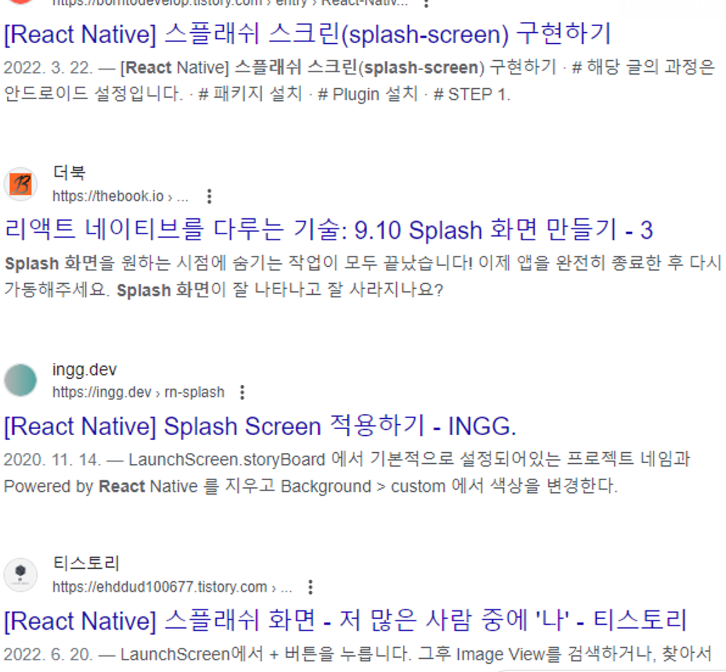

리액트의 특징 중 하나가 SPA이기 때문에 자바스크립트가 실행될때 까지 페이지가 비어 있어서 로딩 대기중의 짦은 시간동안 **빈페이지**가 화면에 띄워져있는다.

유저에게 빈페이지를 보여지는 것은 UX 적으로 좋지 않고 본 프로젝트에서 Splash Screen을 구현하는 것이 요구사항 중 하나이기도 해서 도전해보았다.

하지만 시작부터 난관에 봉착했다. 구글링을 해보니 죄다 react-native에서 구현하는 내용밖에 없었기 때문이다….

하지만 열심히 발품 뛰어보니 해결의 실마리를 찾은 듯 했다.

https://stackblitz.com/edit/idle-timeout-popup-react?file=src%2FDashboard.js,src%2FLogin.js,src%2Findex.js

https://stackoverflow.com/questions/36349890/how-to-show-loading-ui-when-calling-getcomponent-in-react-router

뭐 여기서 할 수 있다는데… 아닌 것 같다ㅋㅋㅋㅋㅋㅋㅋㅋㅋㅋ

문득 생각해보니 애초에 csr인데 ui를 미리 가져오는게 가능한가 싶었다

빈 껍데기html을 가져온 후 번들된 html + css + js 파일을 가져오는게 리액트 렌더링 아키텍쳐인데… 걍 말도 안되는 소릴 하고있었다.

하지만 react도 이제 ssr이 가능하기 때문에 불가능한건 아니었다.

https://solo5star.tistory.com/44

이 링크를 참고해서 만들어보자

express가 필요하다. 서버사이드렌더링이니까!

걍 안하기로 했다. 리액트로는 불가능~

next로 마이그레이션해야하는데 귀찮다. 시간도 없어
