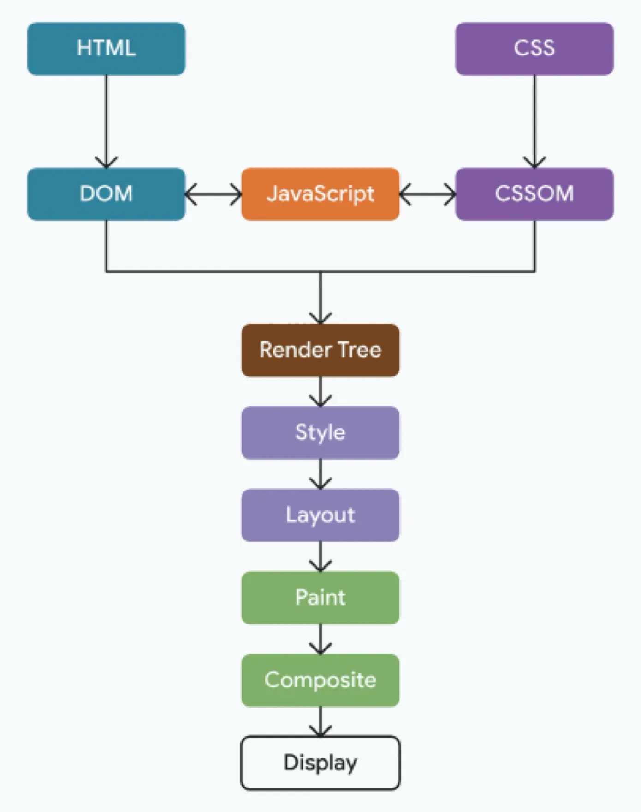

화면을 그릴 때 CSS로 처리할 수 있다면 가급적 CSS로 해결하는 것이 좋습니다. 

그 이유는 브라우저가 화면을 그리는 순서를 보면 알 수 있는데요.

<div class="img-md">



</div>

브라우저 렌더링 과정을 간략하게 보면 아래 순서입니다.

1. HTML을 파싱해 DOM을 만들고 CSS를 파싱해 CSSOM을 만듭니다.
2. 이 둘을 합쳐 화면에 그려질 요소만 남긴 Render Tree를 만듭니다.
3. 각 요소에 최종 적용될 스타일 값을 확정합니다. 미디어 쿼리를 여기서 평가합니다. (Style)
4. 확정된 스타일로 각 요소의 크기와 위치를 계산합니다. Grid와 같은 배치 알고리즘이 도는 곳입니다. (Layout)
5. 계산된 위치에 픽셀을 채웁니다. (Paint)
6. 나눠 그린 레이어를 합쳐 최종 화면을 만듭니다. (Composite)


<br />


여기서 볼 곳은 JavaScript의 위치입니다. 

DOM과 CSSOM 양쪽에 화살표가 걸려 있죠. JS는 이 둘을 읽고 바꿀 수 있고 둘 중 하나를 바꾸면 Render Tree 단계가 다시 돕니다. 즉 자바스크립트로 인해 ui가 변경될 경우 렌더트리를 다시 생성하고 style -&gt; layout -&gt; paint -&gt; composite 단계를 다시 수행합니다.

<br />

반대로 css만으로 ui를 바꾸면 렌더트리부터 다시 도는 일이 없습니다. DOM이 그대로니 렌더트리를 다시 만들 필요가 없고 JS도 실행되지 않아요. 브라우저는 바뀐 스타일에 걸리는 단계만 다시 계산합니다. 같은 화면 변화를 만들어도 거쳐야 하는 단계 자체가 줄어드는 것이죠.

# 리팩토링 이유

즉 JS 기반 UI 제어는 불필요한 리렌더링과 레이아웃 연산을 유발하기 때문에 저또한 JS 기반 로직을 CSS로 대체하는 작업을 진행했습니다.

## 화면 구조

제가 구현해야 했던 화면은 카드 목록 사이에 배너 줄이 끼어드는 리스트 화면이었는데요. 간단하게 도식화하면 아래와 같습니다.

```
1줄   카드  카드  카드  카드  카드
2줄   카드  카드  카드  카드  카드
3줄   [-------- 배너 줄 --------]  
4줄   카드  카드  카드  카드  카드
5줄   카드  카드  카드  카드  카드
6줄   카드  카드  카드  카드  카드
7줄   카드  카드  카드  카드  카드
8줄   [-------- 배너 줄 --------]
9줄   카드  카드  카드  카드  카드   ← 렌더링할 배너가 없으면 카드만 노출
```

그리고 이 리스트 페이지에는 아래 규칙이 존재했습니다.

1. 첫 배너 줄은 카드 2줄 뒤에 들어갑니다.
2. 그 뒤로는 카드 4줄마다 배너 줄이 들어갑니다.
3. 렌더링할 배너가 없으면 카드만 노출시킵니다.
4. 뷰포트 너비에 따라 열 개수가 2개에서 5개까지 달라집니다.

4번이 핵심이었는데요. 열 개수가 화면너비(475px 768px 1024px)에 따라 바뀌면서  카드가 배너 줄 위아래로 옮겨가야 합니다.

만약 화면너비가 1024px -> 475px 로 줄어들었을 경우 리스트 배열 상태는 다음과 같이 변해야합니다.

```
1024px 이상 (5열)

1줄   a   b   c   d   e
2줄   f   g   h   i   j
3줄   [--- 배너 줄 ---]
4줄   k   l   m   n   o
5줄   p   q   r   s   t


475px 이상 (3열)

1줄   a   b   c
2줄   d   e   f
3줄   [배너 줄]
4줄   g   h   i
5줄   j   k   l
6줄   m   n   o
7줄   p   q   r
8줄   s   t
```


화면 너비가 1024px -> 475px로 좁아지면서 1,2 줄에는 a부터 f까지만 들어가고 나머지g h i j 는 배너 줄 아래로 내려갑니다. 배너 줄은 3번 줄에 그대로 있고요.


## 기존 구현

처음 이 화면을 만들 때는 CSS로 풀 수 없다고 판단했습니다. a부터 t까지가 하나의 배열인데 그 사이에 다른 배열의 데이터가 끼어들 수 있을까 싶었거든요. 방법이 떠오르지 않더군요.

<br />

그래서 자바스크립트로 구현했는데요. 제가 구현한 방법(안티패턴...)을 간략히 보면


`window.innerWidth`로 렌더링할 열 개수를 반환하고 카드 배열을 구간별로 잘라 `카드 섹션 → 배너 → 카드 섹션 → 배너` 순서의 DOM을 명시적으로 만들고 있었습니다. 일종의 하드코딩이죠.

```ts
// 뷰포트 너비 별 첫 구간 카드 개수 (열 개수 × 2줄)
export const sliceFirstLine = () => {
  if (typeof window === 'undefined') return 4
  const width = window.innerWidth
  if (width >= 1024) return 10
  if (width >= 768) return 8
  if (width >= 475) return 6
  return 4
}

export const sliceRestLine = () => sliceFirstLine() * 2

export const getFirstLineContentList = (content: CardContent[]) =>
  content.slice(0, sliceFirstLine())

export const getRestLineContentList = (content: CardContent[]) =>
  content.slice(sliceFirstLine())
```

이 유틸을 훅에서 resize 이벤트마다 배열 세 개를 다시 자르도록 했습니다.

```tsx

export default function useSliceContent(content, banner) {
  const [firstLineContentList, setFirstLineContentList] = useState(content)
  const [restLineContentList, setRestLineContentList] = useState(content)
  const [repeatContentCount, setRepeatContentCount] = useState(0)

  useEffect(() => {
    const sliceContentCount = () => {
      setFirstLineContentList(getFirstLineContentList(content))
      setRepeatContentCount(getRepeatCount(content))
      setRestLineContentList(getRestLineContentList(content))
    }
    sliceContentCount()
    window.addEventListener('resize', sliceContentCount)
    return () => window.removeEventListener('resize', sliceContentCount)
  }, [content])
  // ...
}
```

컴포넌트는 남은 카드를 렌더 중에 구간별로 다시 잘라 섹션을 반복해서 그렸습니다.

```tsx

<div className={cn('wrap')}>
  <CardSection content={firstLineContentList} />
  <BannerSwiperList banners={banner.slice(0, 3)} />
  {Array.from({ length: repeatContentCount }, (_, index) => {
    const slicedContent = restLineContentList.slice(
      index * sliceRestLine(),
      (index + 1) * sliceRestLine(),
    )
    return (
      <Fragment key={`section${index}`}>
        <CardSection content={slicedContent} />
        {repeatBannerCount - index > 0 && (
          <BannerSwiperList banners={banner.slice((index + 1) * 3, (index + 2) * 3)} />
        )}
      </Fragment>
    )
  })}
</div>
```


# 문제

기능상 문제는 없었지만 아쉬운 부분이 존재했는데요

### 1. resize 이벤트마다 JS가 렌터트리를 다시 그림

브라우저 창 폭을 드래그로 줄이면 resize 이벤트가 연달아 발생합니다. 이벤트가 발생할 때마다 `window.innerWidth`를 읽고 배열 세 개를 다시 자르고 setState를 호출하고 섹션 DOM을 다시 만듭니다.

문제는 이 과정에서 카드 컴포넌트 트리가 통째로 unmount되고 다시 mount된다는 점입니다. 카드 하나하나가 이미지와 텍스트를 가진 컴포넌트라 개수가 30개만 되어도 오래된 디바이스에선 성능 문제를 일으키기엔 충분한 상황이죠.

### 2. Hydration 에러

`sliceFirstLine`은 서버에서 `typeof window === 'undefined'` 분기를 타서 항상 4를 반환합니다. 서버는 뷰포트 폭을 알 수 없으니까요. 그래서 1024px 이상 디바이스에서 페이지 최초 접근 시 서버가 보낸 2열 기준 HTML이 먼저 그려지고 hydration이 끝난 뒤 5열로 다시 그려집니다. 즉 레이아웃 시프트가 발생합니다.

### 3. 복잡한 자바스크립트 로직

이 페이지 렌더링 방법을 알기 위해선 3개 파일을 열어봐야했습니다.

- utils의 slice 함수 다섯 개
- 훅의 state 세 개와 resize 리스너
- 컴포넌트의 `index * sliceRestLine()` 인덱스 계산

만약 배너 간격을 4줄에서 5줄로 바꾸라는 요구사항이 들어온다면 세 곳 모두를 고쳐야 합니다.

# 해결

이 문제를 해결하기 위해 CSS Grid 기반 렌더링으로 리팩토링했는데요.

CSS Grid를 활용해 어떻게 리팩토링을 했는지 살펴보겠습니다.

## CSS Grid 열 개수 세팅

Grid 컨테이너는 아래와 같이 선언했습니다.

```scss
.card-list {
  display: grid;
  grid-template-columns: repeat(2, 1fr);
}
```

`grid-template-columns: repeat(2, 1fr)` 를 선언하면 폭이 똑같은 2열짜리 그리드를 만들어줍니다. 이게 기본 세팅이고

미디어 쿼리로 브레이크포인트 별 열 개수를 만들어줍니다.

```scss
@media (min-width: 475px)  { .card-list { grid-template-columns: repeat(3, 1fr); } }
@media (min-width: 768px)  { .card-list { grid-template-columns: repeat(4, 1fr); } }
@media (min-width: 1024px) { .card-list { grid-template-columns: repeat(5, 1fr); } }
```

여기까지하면 일단 뷰포트 너비에 따라 열 개수가 2개에서 5개까지 달라져야하는 조건은 충족합니다. 

<br />

문제는 배너 줄이죠. 배너 줄은 한 칸이 아니라 한 줄 전체를 차지해야 하고 정해진 줄 번호에 있어야 합니다. 또한 카드 리스트 중간에 끼어들어야해요.

## grid-column 를 활용한 배너 영역 너비 처리

배너 영역은 grid-column 속성을 활용했는데요

```scss
.banner-row {
  grid-column: 1 / -1;
}
```

grid-column 속성에 부여하는 숫자는 칸이 아니라 열(그리드 라인)입니다. 그리고 라인 번호는 아래와 같이 앞에서 세는 번호와 뒤에서 세는 번호가 동시에 붙어 있습니다.

```
       1     2     3     4     5     6
      -6    -5    -4    -3    -2    -1
       ├─────┼─────┼─────┼─────┼─────┤
       │  a  │  b  │  c  │  d  │  e  │
       └─────┴─────┴─────┴─────┴─────┘
```

1 / -1 은 맨 앞 선에서 맨 뒤 선까지 라는 뜻이 됩니다. 즉 처음부터 끝까지 라는 뜻이죠. 

이 속성을 활용해 배너 리스트 영역이 차지하는 너비를 정의해줄 수 있습니다. 


##  grid-row 를 활용해 배너 리스트 행 세팅

다음은 몇 번째 줄에 배너리스트를 넣을지 세팅해야합니다. 즉 위 언급한대로 몇 번째 줄에 배너리스트가 카드 리스트 중간에 치고들어가야하는지 정의해줘야합니다.

여기서 쓴 게 `grid-row`입니다. `grid-row` 를 사용하면 우리가 원하는 중간에 치고들어가는 화면을 구현할 수 있습니다. 

예를 들어 이렇게 카드 리스트가 위에, 그 아래 배너리스트가 존재해도

```tsx
<ul>
  <li>a</li> <li>b</li> ... <li>t</li>      ← 카드 20개
  <li class="banner-row" style="grid-row:3">  ← 배너는 맨 뒤
</ul>
```

`grid-row : 3` 속성을 부여하면 grid 배치 알고리즘에 의해 화면은 아래와 같이 만들어집니다.

```
1단계 — 명시적으로 정의한 곳부터 배치(grid-row : 3)

1줄 │     │     │     │     │     │
2줄 │     │     │     │     │     │
3줄 │███████████ 배너 ████████████│   ← 자리부터 확보
4줄 │     │     │     │     │     │

```

```
2단계 — 카드가 DOM 순서대로 빈 칸을 채움

1줄 │  a  │  b  │  c  │  d  │  e  │
2줄 │  f  │  g  │  h  │  i  │  j  │
3줄 │███████████ 배너 ████████████│   ← 카드 리스트입장에선 이미 차 있어서 건너뜀
4줄 │  k  │  l  │  m  │  n  │  o  │
5줄 │  p  │  q  │  r  │  s  │  t  │
```

즉 

1. `grid-row: 3`을 가진 배너 줄이 3번 줄을 차지합니다.
2. 카드들이 DOM 순서대로 1번 줄부터 빈 칸을 채웁니다.
3. 3번 줄은 이미 차 있으니 카드는 4번 줄로 넘어갑니다.

```tsx
<li className={cn('banner-row')} style={{ gridRow: 3 }}>
```


디바이스 너비가 바뀌어도 배너리스트 행 위치는 동일합니다.

```
5열 (1024px 이상)              3열 (475px 이상)

1줄    1   2   3   4   5       1줄    1   2   3
2줄    6   7   8   9  10       2줄    4   5   6
3줄   [---- 배너 줄 ----]      3줄   [-- 배너 줄 --]
4줄   11  12  13  14  15       4줄    7   8   9
5줄   16  17  18  19  20       5줄   10  11  12
```

## 배너리스트가 들어갈 행 번호 구하기

이제 `grid-row`에 넣을 숫자만 구하면 됩니다. 단순히 3을 넣으면 안되는게 요구사항이 첫 배너리스트 행은 3번째, 그 뒤론 카드4줄, 배너 1줄이 반복되어야하기 떄문에 8, 13, 18.. 이 되어야했거든요.


```ts
const FIRST_BLOCK_ROWS = 2 // 첫 배너 줄 위에 들어가는 카드 줄 수
const REST_BLOCK_ROWS = 4  // 배너 줄 사이에 들어가는 카드 줄 수

export function getBannerGridRow(bannerRowIndex: number) {
  return FIRST_BLOCK_ROWS + 1 + bannerRowIndex * (REST_BLOCK_ROWS + 1)
}
```

배너리스트의 인덱스값을 통해  `grid-row`에 넣을 숫자를 구하는 유틸함수를 만들어주면 됩니다. 


이 상태에서 만약 더 이상 렌더링할 배너리스트가 없으면 어떻게 될까요? 다행히도 배너가 없으면 차지하는 줄 즉 `grid-row: 이 숫자` 가 없기 때문에 카드 리스트만 렌더링됩니다. 요구사항을 충족시키는 구현이죠. 

## 완성된 코드

그래서 최종 완성 코드는 아래와 같습니다. 

```scss
.card-list {
  display: grid;
  grid-template-columns: repeat(2, 1fr);
  column-gap: 16px;
  row-gap: 24px;
  width: 100%;

  .banner-row {
    grid-column: 1 / -1;
    min-width: 0;
    max-width: 1200px;
  }
}

@media (min-width: 475px)  { .card-list { grid-template-columns: repeat(3, 1fr); } }
@media (min-width: 768px)  { .card-list { grid-template-columns: repeat(4, 1fr); } }
@media (min-width: 1024px) { .card-list { grid-template-columns: repeat(5, 1fr); } }
```


```tsx
export default function CardList({ content, banner }: CardListProps) {
  const columns = useGridColumns()
  const bannerRows = chunkBanners(banner).slice(0, getMaxBannerRowCount(content.length, columns))

  return (
    <ul className={cn('card-list')}>
      {content.map((item, index) => (
        <CardItem key={`${item.id} ${index}`} item={item} />
      ))}
      {bannerRows.map((banners, index) => (
        <li
          key={`banner-row${index}`}
          className={cn('banner-row')}
          style={{ gridRow: getBannerGridRow(index) }}
        >
          <BannerSwiperList banners={banners} />
        </li>
      ))}
    </ul>
  )
}
```

## 마지막 JS까지 제거하기

다 구현된 것처럼 보이지만 옥의 티가 존재합니다. 위 코드보시면 `useGridColumns` 훅이 존재하는데 저 훅은 어떤 역할일까요?

<br />

저희가 짠 코드는 `grid-row`로 배너 행 번호가 고정되어 있습니다. 만약 카드 리스트 개수가 턱없이 부족하면 어떻게 될까요. 

첫 번째 배너리스트 상단 영역을 채울 카드가 부족하면 빈 줄이 생겨요. `grid-row` 로 고정시켰기 떄문이죠. 아래처럼 말이죠.

```
1줄   a   b   c   d   .
2줄   .   .   .   .   .   ← 텅 비어있는 두번 째 줄
3줄   [--- 배너 줄 ---]
```


이걸 막으려면 비어있는 배너 행을 아예 그리지 않아야 하고 이를 위해선 열 개수 알아야합니다. 이 조건은 CSS로 대응할 수가 없어요. CSS는 이미 만들어진 요소를 숨길 수는 있지만 요소를 만들지 않는 선택은 할 수 없거든요.

### `matchMedia` 를 활용한 `useGridColumns` 훅

이러한 엣지케이스를 대응하기 위해 만든 훅이 `useGridColumns` 입니다. 기존 resize 이벤트 대신 `matchMedia`를 활용해서 브라우저 너비가 브레이크포인트를 넘을 때만 이벤트가 발생하도록 나름의 최적화를 하긴 했어요.

```ts
// 배너 줄 위 카드 블록이 가득 찰 때만 배너 줄을 그립니다
export function getMaxBannerRowCount(contentCount: number, columns: number) {
  const firstBlockCount = FIRST_BLOCK_ROWS * columns
  if (contentCount < firstBlockCount) return 0
  return Math.floor((contentCount - firstBlockCount) / (REST_BLOCK_ROWS * columns)) + 1
}
```

```tsx
const GRID_COLUMN_QUERIES = [
  { columns: 5, query: '(min-width: 1024px)' },
  { columns: 4, query: '(min-width: 768px)' },
  { columns: 3, query: '(min-width: 475px)' },
]
const DEFAULT_COLUMNS = 2

function subscribe(onStoreChange: () => void) {
  const mediaQueryLists = GRID_COLUMN_QUERIES.map(({ query }) => window.matchMedia(query))
  mediaQueryLists.forEach((list) => list.addEventListener('change', onStoreChange))
  return () => {
    mediaQueryLists.forEach((list) => list.removeEventListener('change', onStoreChange))
  }
}

function getColumns() {
  return GRID_COLUMN_QUERIES.find(({ query }) => window.matchMedia(query).matches)?.columns
    ?? DEFAULT_COLUMNS
}

export default function useGridColumns() {
  return useSyncExternalStore(subscribe, getColumns, () => DEFAULT_COLUMNS)
}
```

### 근데 카드가 정말 그렇게 적게 내려오는 경우가 있나요?

우여곡절 끝에 만들긴했지만 결국 JS를 사용한다는건 그대로 였습니다. 여러 단점을 개선했지만 완벽하진 않다 생각했어요. 

그때 문득 든 생각이 카드리스트(사내 작품리스트) 가 그렇게 적게 내려올 일이 있나 싶었습니다. 
`useGridColumns` 훅은 렌더링할 카드가 부족한 경우를 막으려고 있는 건데 그런 경우가 실제로 있는지는 확인한 적이 없었거든요.

카드리스트가 항상 충분히 내려온다 보장되어있음 `useGridColumns` 훅을 제거할 수 있겠다라는 생각이 들어 먼저 빈 줄이 생기려면 카드가 얼마나 적어야 하는지부터 계산했습니다. 

5열일 때 카드가 가장 많이 필요하니 계산해보면 대충 30장이 나옵니다. 


- 1번째 배너 줄 (3번 줄)  : 위에 카드 2줄  → 카드 10장
- 2번째 배너 줄 (8번 줄)  : 위에 카드 6줄  → 카드 30장


그리고 백엔드에 문의했더니 카드가 30개 미만으로 내려오는 경우는 없다는 답을 받았습니다. 즉 저희가 걱정한 카드 개수가 부족한 경우는 발생하지 않는다는거죠. 

<br/>

그래서 `useGridColumns`와 `getMaxBannerRowCount`를 지웠습니다. 그리고 아래와 같이 코드를 최종 완성했습니다.

```tsx

export default function CardList({ content, banner }: CardListProps) {
  const bannerRows = chunkBanners(banner)

  return (
    <ul className={cn('card-list')}>
      {content.map((item, index) => (
        <CardItem key={`${item.id} ${index}`} item={item} />
      ))}
      {bannerRows.map((banners, index) => (
        <li
          key={`banner-row${index}`}
          className={cn('banner-row')}
          style={{ gridRow: getBannerGridRow(index) }}
        >
          <BannerSwiperList banners={banners} />
        </li>
      ))}
    </ul>
  )
}
```

### 배너가 안 내려오는 경우

다만 배너리스트는 내려오지 않을 때가 있다는 답변을 받았습니다. 하지만 이는 걱정하지 않아도 됩니다. 

```ts
chunkBanners([]) // → []
```

`bannerRows`가 빈 배열이라 `li.banner-row`가 하나도 만들어지지 않습니다. `grid-row`로 줄을 차지하는 요소가 없으니 카드리스트는 정상적으로 빈공간 없이 렌더링되기 때문이죠. 

### 최종적으로 남은 JS

- `chunkBanners` : 배너 배열을 3개씩 분할
- `getBannerGridRow` :  `grid-row`에 넣을 줄 숫자 반환

두 함수 모두 렌더할 때 한 번 실행되고 끝납니다. `resize`, `matchMedia` 와 같은 이벤트가 없기 때문에 단순 유틸함수일 뿐이죠. 

# 전후 비교

리팩토링을 완료했으니 얼마나 나아졌는지 테스트를 해보았습니다. 지표 결과는 아래와 같습니다.

부하는 resize 이벤트로 줬습니다. 이번 리팩토링이 바꾼 게 브라우저 너비 변화에 대한 반응이니까요.

## 결과


| 지표                     | 이전 구현  | 새 구현   | 변화   |
| ---------------------- | ------ | ------ | ---- |
| 총 렌더 횟수                | 47,327 | 14,995 | -68% |
| 컴포넌트 mount 횟수          | 11,864 | 2,567  | -78% |
| 리렌더 횟수                 | 35,463 | 12,428 | -65% |
| 카드 하위 컴포넌트의 파이버 인스턴스 수 | 1,212  | 134    | -89% |


mount 횟수와 파이버 인스턴스 수의 차이가 크다는걸 확인할 수 있습니다. 
이전 구현은 창 폭이 바뀔 때마다 배열을 다시 잘라 섹션을 다시 만드니 카드 트리가 unmount와 mount를 반복했기 때문이죠.

새 구현에 남은 리렌더는 대부분 페이지의 다른 컴포넌트에서 나왔습니다. 유의미한 차이가 나왔네요.

# 마치며

레이아웃 렌더링 방식을 JS에서 CSS로 옮기면서 다음과 같은 이점을 얻을 수 있었습니다.

1. **resize 이벤트 비용 제거** 

CSS 미디어쿼리 및 grid를 활용했기에 resize 이벤트가 발생해도 JS가 실행되지 않습니다.


2. **hydration 이슈로 인한 레이아웃 시프트 제거** 

서버가 만든 HTML과 브라우저가 그린 결과가 같으니 hydration 직후 카드 위치가 바뀌지 않습니다.


3. **복잡한 JS로직 제거** 

차후 요구사항이 변경되어 배너 간격을 바꿔야 하더라도 상수만 고치면 됩니다.

<br />

사실 실서비스 환경에서 브라우저 너비를 줄였다 늘였다 하는 유저는 거의 없기 때문에 눈에 띄는 성능 개선이라 하긴 어렵습니다. 

디바이스 가로세로 전환 혹은 오래된 디바이스 환경에선 유의미한 성능 개선이라고 생각합니다. 무엇보다 안티패턴을 개선한 것도 의미있구요.

여러모로 의미있는 리팩토링이었습니다. 

<details>

<summary>참고문헌</summary>

<div markdown="1">

https://developer.mozilla.org/en-US/docs/Web/CSS/CSS_grid_layout/Grid_layout_using_line-based_placement

https://developer.mozilla.org/en-US/docs/Web/CSS/CSS_grid_layout/Auto-placement_in_grid_layout

https://studiomeal.com/archives/533/

</div>

</details>

