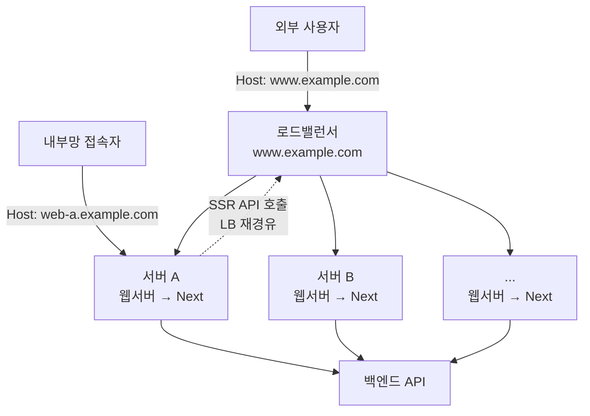

사내 서비스를 운영하다 보면 사용자는 멀쩡한데 내부에서만 재현되는 장애를 만날 때가 있습니다.

이번 글에서는 서버 페칭 코드가 브라우저에게 받은 요청 헤더를 Host까지 포함해 통째로 복사하면서 생긴 장애를 추적한 과정을 공유합니다.

증상은 두 가지였습니다. 내부망에서 개별 서버 도메인으로 접속할 때만 오류 페이지가 랜덤하게 뜨고 백엔드 로그에는 채널 헤더가 `AW, AW`로 중복돼 찍혔습니다.

# 문제 상황

먼저 백엔드에서 제보가 들어왔습니다. API 요청에 채널을 구분하는 헤더가 하나 붙는데 그 값이 `AW`가 아니라 `AW, AW`로 도착하는 요청이 있다는 것이었어요.

비슷한 시점에 QA에서도 제보가 왔습니다. 배포 후 서버별 확인을 위해 개별 서버 도메인으로 접속하면 페이지가 오류 페이지로 떨어질 때가 있다는 내용이었습니다.

문제는 **매번 그러는 게 아니라는 점**이었습니다. 같은 주소를 새로고침하면 어떨 땐 정상이고 어떨 땐 오류 페이지였어요. 공용 도메인으로 접속하면 아무 문제가 없었고요.

두 제보는 따로 들어왔지만 결국 같은 원인이었습니다. 그걸 이해하려면 배포 구조를 먼저 봐야 합니다.

# 배경

## 공용 도메인과 개별 서버 도메인

보통 서비스를 운영하는 회사들은 서버를 한 대만 두지 않습니다. 트래픽을 감당하려고 여러 대를 두고 그 앞에 로드밸런서를 놓아 요청을 나눠주죠. 저희 서비스에도 이렇게 로드밸런싱을 하는 구간이 있습니다.

그래서 `www.example.com` 같은 공용 도메인은 특정 서버의 주소가 아닙니다. **로드밸런서의 주소**이고 실제 요청은 그 뒤의 서버 중 하나로 배분됩니다. 같은 주소로 접속해도 어느 서버가 응답할지는 요청마다 달라져요.

`web-a.example.com` 처럼 서버 한 대를 직접 가리키는 주소도 따로 있습니다. 이런 주소는 외부에 공개하지 않고 사내 네트워크에서만 접근할 수 있게 막아둡니다. 배포 후 서버별 정상 확인이나 모니터링 같은 운영과 QA 용도입니다. 이번 장애도 운영 서버를 사내에서 개별 주소로 확인하다 발견됐습니다.

## Host 헤더와 가상호스트 매칭

> Host 헤더란? <br /> 브라우저가 **사용자가 접속한 도메인**을 기록해 보내는 HTTP 헤더입니다. 요청이 실제로 어느 서버에 도달했는지와는 무관한 값이고 로드밸런서도 이 값을 바꾸지 않습니다.

각 서버 앞단의 웹서버(nginx 계열)는 이 Host 헤더를 자기 설정의 도메인 목록과 비교해 어떤 사이트로 응답할지 정합니다. 서버들은 공통으로 공용 도메인인 `www.example.com` 과 자기 자신의 개별 도메인을 설정에 등록해두고 있습니다.

여기서 중요한 건 **매칭에 실패해도 요청을 거절하지 않는다**는 점입니다. 목록에 없는 Host가 들어오면 기본 서버 블록으로 처리하는 것이 nginx 계열의 기본 동작이에요. 별도로 설정한 것이 아니라 설정 파일의 첫 번째 블록이 자동으로 기본 서버가 됩니다.

이번 사례에서는 그 기본 서버가 하필 서비스 블록이었습니다. 그래서 매칭에 실패한 요청에 서비스의 `/` 페이지 HTML이 응답됐습니다.

## SSR 서버 페칭은 그냥 하나의 HTTP 클라이언트다

Next.js 서버는 페이지를 렌더링하려고 직접 백엔드 API를 호출합니다. 당시 코드는 브라우저가 보낸 요청 헤더를 API 요청에 통째로 복사해 전달하고 있었고 API 주소는 브라우저와 같은 공용 도메인이었습니다.

네트워크 관점에서 이 호출은 일반 사용자의 브라우저 요청과 똑같은 흐름을 탑니다.

```
일반 사용자:  브라우저      → DNS 조회(www.example.com) → LB IP → 서버 중 하나
SSR 페칭:    서버 A의 Next → DNS 조회(www.example.com) → LB IP → 서버 중 하나
```

Next 서버도 API를 호출할 때는 하나의 HTTP 클라이언트일 뿐입니다. 코드나 OS 어디에도 "이 서버는 로드밸런서 뒤의 배분 대상 중 하나이며 API는 자기 자신에게 보내면 된다"는 정보가 없어요. 그래서 일반 클라이언트와 동일하게 공용 도메인을 DNS로 해석해 로드밸런서로 보냅니다.

일반 사용자와의 차이는 두 가지뿐입니다.

| 구분 | 일반 사용자 | SSR 페칭 |
| --- | --- | --- |
| 출발 위치 | 인프라 밖 | 인프라 안 (자신도 배분 대상) |
| Host 헤더 | 접속한 도메인으로 새로 생성 | **받았던 헤더를 그대로 복사** |

두 번째 줄이 이번 장애의 원인입니다.

## 전체 구조



각 서버의 웹서버는 페이지 요청을 Next 컨테이너로, API 요청을 백엔드로 프록시합니다. 그리고 서버 A의 Next가 SSR 중에 API를 호출하면 그 요청은 공용 도메인을 타고 **로드밸런서를 다시 거칩니다.** 어느 서버로 배분될지는 알 수 없고요.

# 원인

## 장애 연쇄

내부망에서 `web-a.example.com` 으로 접속한 순간부터 백엔드에 `AW, AW`가 도착하기까지를 순서대로 따라가 보겠습니다.

### 1. 잘못된 Host가 API 요청에 실린다

브라우저가 `Host: web-a.example.com` 을 담아 요청을 보냅니다. 서버 A의 Next는 SSR 중 API를 공용 도메인으로 호출하면서 받은 헤더를 통째로 복사합니다. 이때 Host도 같이 복사돼서 **API 요청에 `web-a.example.com` 이 실려 나갑니다.**

여기서 직접 접속의 주체가 사람만은 아니라는 점을 짚어둘 필요가 있습니다. 배포 후 스모크 체크, 헬스체크와 모니터링 도구, 사내 공유 링크까지 개별 서버 도메인으로 향하는 내부망 트래픽은 일상적으로 존재합니다.

### 2. 다른 서버에 도달하면 매칭에 실패한다

이 요청은 로드밸런서를 거쳐 뒤에 있는 서버 중 아무 데나 도달합니다. 서버 A가 아닌 다른 서버에 도달하면 `web-a.example.com` 은 그 서버에 등록되지 않은 도메인이라 매칭에 실패합니다.

그리고 앞서 본 대로 요청이 거절되는 대신 기본 서버 블록으로 넘어가 **API 응답 대신 `/` 페이지 HTML이 반환됩니다.**

요청이 서버 A로 되돌아오면 자기 도메인이니 정상입니다. **자기 자신에게 배분됐을 때만 정상이라 랜덤하게 재현된 것**이죠.

### 3. 반환된 페이지가 2차 SSR을 일으킨다

여기서 한 겹이 더 쌓입니다. 반환된 `/` 페이지도 결국 SSR로 렌더링되는 페이지라 **그 서버에서 또 한 번 API 호출이 발생합니다.**

이 시점의 요청 헤더에는 1차 호출이 추가한 `Service-Channel: AW`가 이미 들어 있습니다. Next는 이걸 소문자 `service-channel`로 보관하고 있는데 코드는 대문자 `Service-Channel`을 다시 추가합니다. JavaScript 객체 키로는 서로 다른 키라 **둘 다 남습니다.**

### 4. HTTP 계층이 두 헤더를 병합한다

HTTP 헤더 이름은 대소문자를 구분하지 않습니다. 그래서 대소문자만 다른 두 헤더는 같은 이름으로 취급되어 쉼표로 합쳐집니다. 백엔드에 `AW, AW`가 도달하는 지점이 여기입니다.

정리하면 이렇게 흘러갑니다.

```
[정상]  브라우저 ── Host: www.example.com ──▶ LB ──▶ 어느 서버든 매칭 성공

[장애]  브라우저 ── Host: web-a ──▶ 서버 A 직접
          └─ 1차 SSR: 공용 도메인 호출 (Host: web-a 복사됨)
               └─▶ LB ──▶ 다른 서버 도달 ── 매칭 실패 ──▶ '/' HTML 응답
                     └─ 2차 SSR ── 채널 헤더 중복 ──▶ 백엔드: AW, AW
```

**채널값 중복은 근본 원인이 아니라 잘못된 Host 전달이 만든 요청 중첩의 결과**였습니다. 백엔드가 본 `AW, AW`는 증상이었던 셈이죠.

## 왜 일반 사용자는 문제가 없었나

일반 사용자 요청도 똑같이 여러 서버로 배분됩니다. 차이는 도달한 서버가 아니라 **요청에 담긴 Host 헤더**입니다.

| Host 헤더 | 도달 서버 | 결과 |
| --- | --- | --- |
| `www.example.com` | 어느 서버든 | 모든 서버에 등록된 도메인 → 정상 |
| `web-a.example.com` | 서버 A | 자기 도메인 → 정상 |
| `web-a.example.com` | 그 외 서버 | 등록되지 않은 도메인 → 기본 페이지 (장애) |

결함은 "받은 Host를 그대로 복사해 전달"인데 공용 도메인으로 들어온 트래픽은 복사된 값이 원래 설정됐어야 할 값과 같습니다. Host를 복사하지 않았더라도 HTTP 클라이언트가 요청 대상인 `www.example.com`을 자동으로 채웠을 테니 결과에 차이가 없어요.

즉 **접속 도메인과 API 호출 도메인이 일치하는 동안에는 드러나지 않는 결함**이었고 일반 서비스 트래픽은 전부 그 조건에 해당했습니다.

## 특정 서버가 고장난 건 아닐까

처음엔 특정 서버의 상태 문제를 의심했습니다. 하지만 아니었어요. 서버의 상태 문제가 아니라 **요청 단위의 조건부 버그**입니다.

같은 서버가 같은 시점에 Host가 공용 도메인인 요청은 정상 처리하고 개별 도메인 접속에서 파생된 요청만 설정대로 기본 페이지로 처리했습니다. 서버는 두 경우 모두 설정대로 동작했고 결함은 API 요청에 잘못된 Host를 전달한 프론트 코드에 있었습니다.

## 아무도 개별 도메인에 접근하지 않았다면

그랬다면 백엔드는 `AW, AW`를 볼 수 없었습니다. 중복은 개별 도메인 접속이 만드는 연쇄인 2차 SSR 안에서만 발생하니까요.

백엔드가 처음 "채널값이 이상하다"에서 이후 "개별 서버 도메인으로 들어온 요청에서만 발생"으로 범위를 좁힌 것도 로그의 `AW, AW`가 전부 전달된 Host 헤더와 엮여 있었기 때문입니다. 개별 서버 도메인을 일상적으로 쓰는 내부망 트래픽이 있었기에 드러난 버그였던 셈이죠.

# 해결

## 서버 페칭에서 host 헤더만 제외한다

헤더를 복사해 전달하던 서버 페칭 코드에서 host만 빼고 전달하도록 수정했습니다.

```diff
- ...Object.fromEntries(headers().entries()),
+ ...Object.fromEntries(
+   headers()
+     .entries()
+     .filter(([key]) => key.toLowerCase() !== 'host'),
+ ),
```

Host를 전달하지 않으면 HTTP 클라이언트가 실제 요청 대상인 `www.example.com`을 Host로 자동 설정합니다. 요청이 어느 서버에 도달해도 도메인이 정상 매칭되고 요청 중첩과 채널 헤더 중복도 함께 사라집니다.

## 수정 범위

당시 서버 페칭에는 axios와 네이티브 fetch 두 클라이언트가 공존했습니다. 수정 대상은 특정 클라이언트가 아니라 "헤더 통째 복사"라는 공통 패턴이 있던 세 곳 전부였습니다.

| 파일 | HTTP 클라이언트 | 수정 지점 |
| --- | --- | --- |
| `axiosServer.ts` | axios | 요청 인터셉터에서 헤더를 복사하는 곳 |
| `ServerFetch.ts` | 네이티브 fetch | fetch 래퍼가 `RequestInit.headers`를 구성하는 곳 |
| `serverUtils.ts` | 네이티브 fetch | 전달용 헤더 객체를 만드는 유틸(`serverHost()`) |

## 헤더를 병합한 주체는 누구인가

여기서 궁금한 게 하나 남습니다. 대소문자만 다른 두 헤더를 쉼표로 합친 게 정확히 어느 계층일까요? 실제로 재현해봤더니 계층마다 동작이 달랐습니다.

| 계층 | 동작 | 결과 |
| --- | --- | --- |
| axios 1.x | `AxiosHeaders`가 이름을 `toLowerCase()`로 정규화 → **중복 제거** | `AW` |
| 네이티브 fetch | `Headers`가 같은 이름의 값을 `", "`로 **결합해 한 라인 전송** | `AW, AW` |
| Node.js http 수신측 | 중복 헤더 라인을 `", "`로 **병합** | `AW, AW` |

axios는 오히려 중복을 지워버립니다. 장애 당시 버전인 1.10.0으로 실측했더니 수신측에 `AW` 하나만 도달했어요. 그러니 `AW, AW`를 만든 경로는 fetch의 combine 규칙 쪽이거나 수신측 병합입니다.

다만 **이 수정은 병합 주체와 무관하게 유효합니다.** host를 제외하면 매칭 실패 → `/` HTML 응답 → 2차 SSR이라는 연쇄 자체가 시작되지 않으니까요. 1차 호출이 추가한 채널 헤더가 2차 SSR의 수신 헤더에 존재하는 상황이 만들어지지 않습니다.

어느 계층이 어떻게 병합하느냐는 그 다음 단계의 문제라 근본 원인인 host 전달을 막은 것으로 전부 해소됩니다.

# 후속 개선

## SSR 요청 경로를 자기 서버로 고정한다

위 수정은 요청이 어느 서버에 도달해도 정상 동작하게 만든 것입니다. 그런데 애초에 SSR 요청이 다른 서버로 나가야 할 이유가 없죠.

그래서 SSR 요청이 처음부터 자기 서버로 가도록 구조를 바꿨습니다. 앱 코드와 웹서버 설정은 그대로 두고 배포 시 `docker run`에 옵션 한 줄을 추가하는 방식입니다.

```bash
--add-host www.example.com:host-gateway
```

동작 원리는 세 가지로 나눠 볼 수 있습니다.

- **이름 조회 순서** — 프로그램이 도메인의 IP를 조회할 때 OS는 DNS 서버에 묻기 전에 로컬의 `/etc/hosts` 파일을 먼저 확인합니다. 파일에 항목이 있으면 DNS 질의 없이 그 IP를 씁니다.
- **`--add-host`** — Next 앱은 각 서버에서 도커 컨테이너 안에서 돌아갑니다. 이 옵션은 컨테이너를 만들 때 컨테이너 내부의 hosts 파일에 항목을 추가합니다.
- **`host-gateway`** — 도커의 특수 키워드로 컨테이너가 실행 중인 호스트 서버의 IP(보통 `172.17.0.1`)로 치환됩니다. 어느 서버에서 실행되든 그 서버 자신을 가리키니 **같은 스크립트로 서버마다 자기 자신을 향하게** 됩니다.

```
[변경 전]  SSR이 www.example.com 호출 → DNS(외부 리졸버) → LB → 서버 중 랜덤
[변경 후]  SSR이 www.example.com 호출 → /etc/hosts → 자기 서버의 웹서버 → 백엔드
```

앱은 여전히 `www.example.com`이라는 이름으로 호출합니다. 그 이름이 해석되는 IP만 로드밸런서에서 자기 서버로 바뀔 뿐이에요. 도메인은 그대로라 Host 헤더와 TLS 인증서 검증도 기존과 동일하게 통과하고 자기 서버의 웹서버는 기존 프록시 규칙대로 백엔드에 전달합니다.

브라우저의 클라이언트 요청은 컨테이너 밖에서 발생하니 이 설정과 무관하게 기존처럼 로드밸런서를 거칩니다. **SSR 요청에만 적용되는 변경**입니다.

## 무엇이 좋아졌나

목적은 두 가지였습니다.

**장애 격리**입니다. 변경 전 실측에서 SSR 요청 대부분이 자기 서버가 아닌 다른 서버로 나가고 있었습니다. 한 서버의 장애가 다른 서버의 페이지 렌더링까지 번지는 구조였는데 변경 후에는 SSR 요청이 전부 자기 서버 안에서 처리됩니다.

**외부 리졸버 의존 제거**입니다. 변경 전에는 이름 조회가 매번 외부 DNS로 나갔습니다. 자사 서버 간 통신이 외부 DNS 장애의 영향을 받을 수 있는 의존을 hosts 파일 방식이 함께 없앱니다.

속도 개선은 부수적입니다. 콜드 커넥션 기준 수 ms 수준이고 커넥션이 유지되는 동안은 차이가 없어요. 중요한 건 **요청이 어느 서버에 도달할지 알 수 없어서 생기는 종류의 문제가 재발할 수 없다**는 점입니다.

# 마치며

증상은 랜덤 오류 페이지와 중복된 헤더값 두 가지였지만 원인은 한 줄이었습니다. 받은 헤더를 Host까지 통째로 복사한 것이죠.

이번 작업에서 얻은 것들을 정리하면 이렇습니다.

| 구분 | 내용 |
| --- | --- |
| **드러나지 않는 결함이 있다** | Host 복사는 처음부터 잘못이었지만 접속 도메인과 API 도메인이 같은 동안은 결과가 동일해서 증상이 없었습니다. |
| **랜덤은 확률이 아니라 분기다** | 운이 나빠 가끔 실패한 게 아닙니다. 요청이 자기 서버로 돌아왔는지에 따라 성패가 갈렸습니다. |
| **증상과 원인은 다른 계층에 있다** | 백엔드가 본 `AW, AW`는 헤더 병합 문제로 보였지만 실제 원인은 그 위의 요청 중첩이었습니다. |
| **서버는 그냥 클라이언트다** | Next 서버는 자신이 로드밸런서 뒤에 있다는 걸 모릅니다. 공용 도메인으로 호출하면 자기 요청이 자기에게 돌아올 수도 있고 남에게 갈 수도 있습니다. |

특히 세 번째가 컸는데요. 채널 헤더 중복만 보고 헤더 병합 로직을 고쳤다면 랜덤 오류 페이지는 그대로 남았을 겁니다. 두 제보를 따로 처리하지 않고 하나로 묶어본 게 결정적이었습니다.

<details>

<summary>참고문헌</summary>

<div markdown="1">

Next.js와 헤더

https://nextjs.org/docs/app/api-reference/functions/headers

https://developer.mozilla.org/en-US/docs/Web/API/Headers

헤더 병합 규칙

https://fetch.spec.whatwg.org/#concept-header-list-combine

https://nodejs.org/api/http.html#messageheaders

https://developer.mozilla.org/en-US/docs/Web/HTTP/Headers/Host

가상호스트와 도커

https://nginx.org/en/docs/http/request_processing.html

https://docs.docker.com/reference/cli/docker/container/run/#add-host

</div>

</details>
