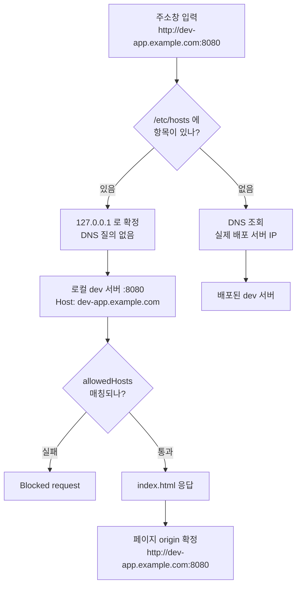

로컬 개발 서버는 보통 `http://localhost:8080` 으로 띄웁니다. 그런데 이렇게 띄우면 로그인도 안 되고 API 호출도 전부 막히는 프로젝트가 있어요.

해결은 `/etc/hosts` 에 한 줄을 추가하는 것입니다. 이번 글에서는 그 한 줄이 무엇을 바꾸는지 그리고 그 뒤로 브라우저 요청이 어떤 경로를 지나 로컬 서버에 도달하는지 정리합니다.

# hosts 파일이 하는 일

추가하는 줄은 이것 하나입니다.

```
127.0.0.1 dev-app.example.com
```

> hosts 파일이란? <br /> 도메인 이름과 IP를 직접 적어두는 OS의 로컬 파일입니다. macOS와 리눅스는 `/etc/hosts` 에 있고 윈도우는 `C:\Windows\System32\drivers\etc\hosts` 에 있습니다.

## 이름을 IP로 바꾸는 첫 번째 관문

OS는 도메인을 IP로 변환할 때 DNS 서버에 묻기 전에 hosts 파일을 먼저 확인합니다.

- **항목이 있으면** 그 IP로 확정하고 DNS 질의를 아예 하지 않습니다.
- **항목이 없으면** DNS 조회 결과인 실제 배포 서버 IP로 연결됩니다.

위의 한 줄은 "이 도메인은 내 컴퓨터를 가리킨다"를 OS에 알려주는 것입니다. 그래서 매핑이 살아있는 동안에는 `dev-app.example.com` 이 항상 로컬로 연결돼요.

## 포트는 관여하지 않는다

hosts는 이름과 IP의 매핑만 담당합니다. 포트를 적을 자리가 아예 없어요.

`http://dev-app.example.com:8080` 으로 접속할 때 `:8080` 은 hosts가 붙여준 값이 아닙니다. 제가 주소창에 직접 입력한 값이죠. hosts가 이름을 `127.0.0.1` 로 바꿔주고 브라우저는 그 IP의 8080 포트로 연결합니다.

## 리다이렉트가 아니다

여기가 이 글에서 가장 중요한 부분입니다. hosts 매핑은 주소를 다른 주소로 바꿔 보내는 리다이렉트가 아닙니다. **연결할 IP만 바뀌고 도메인 이름은 그대로 남습니다.**

그래서 요청이 로컬 서버에 도달해도 HTTP 요청 헤더는 이렇게 유지됩니다.

```
GET / HTTP/1.1
Host: dev-app.example.com
```

`localhost` 로 접속했다면 `Host: localhost` 였을 값이에요. 그리고 이 남아있는 이름이 뒤의 모든 것을 결정합니다.

# 왜 localhost 로는 안 되나

## origin은 페이지가 로드된 주소에서 만들어진다

> origin 이란? <br /> 스킴과 호스트와 포트를 합친 값입니다. `http://dev-app.example.com:8080` 처럼 셋 중 하나라도 다르면 다른 origin으로 취급됩니다.

브라우저는 index.html을 받는 시점에 그 페이지의 origin을 기록합니다. 이후 이 페이지가 보내는 모든 요청에 그 값이 따라붙어요.

| 접속 주소 | 페이지 origin |
| --- | --- |
| `http://localhost:8080` | `http://localhost:8080` |
| `http://dev-app.example.com:8080` | `http://dev-app.example.com:8080` |

두 번째 줄이 hosts 매핑으로 얻는 결과입니다. 실제 파일은 제 컴퓨터에서 서빙되지만 브라우저가 보기에 이 페이지는 example.com 아래의 페이지예요.

## origin이 바뀌면 두 가지가 깨진다

그렇다면 origin이 `localhost` 일 때는 정확히 무엇이 안 되는 걸까요?

### 1. 쿠키가 실리지 않는다

로그인 세션 쿠키는 보통 `.example.com` 처럼 상위 도메인 스코프로 심습니다. 그래야 같은 회사의 여러 서비스가 세션을 공유할 수 있으니까요.

브라우저는 쿠키를 **도메인 기준으로** 붙입니다. `localhost` 페이지에서 나가는 요청은 example.com과 아무 관계가 없으니 이 쿠키가 실리지 않아요. 다른 서비스에 이미 로그인해 두었어도 로그인하지 않은 것처럼 동작합니다.

### 2. CORS에서 차단된다

API 서버는 허용할 origin 목록을 들고 있습니다. 여기에 개발자 개인 PC의 `http://localhost:8080` 이 들어있을 리 없어요.

요청은 서버까지 도달하지만 응답에 허용 헤더가 없으니 브라우저가 응답을 차단합니다. 콘솔에는 CORS 오류만 남고 코드는 데이터를 받지 못하죠.

| 접속 주소 | 세션 쿠키 | API 호출 |
| --- | --- | --- |
| `http://localhost:8080` | 스코프가 달라 실리지 않음 | 허용 목록에 없어 CORS 차단 |
| `http://dev-app.example.com:8080` | `.example.com` 스코프에 포함 | 허용 목록 통과 |

로컬 개발 서버에 실제 도메인 이름을 붙이는 이유가 여기 있습니다. 코드를 어디서 서빙하느냐가 아니라 **브라우저가 이 페이지를 어느 도메인의 페이지로 보느냐**를 맞추는 작업이에요.

# 해결

## 1. hosts에 매핑을 추가한다

매번 손으로 편집하면 실수가 나니 스크립트로 감싸 둡니다.

```json
"setup:hosts": "sudo bash scripts/setup-hosts.sh",
"remove:hosts": "sudo bash scripts/remove-hosts.sh"
```

하는 일은 `/etc/hosts` 에 한 줄을 추가하거나 제거하는 것이 전부입니다. 다만 세 가지를 챙겨야 해요.

- **권한을 먼저 확인합니다.** `/etc/hosts` 는 root만 쓸 수 있습니다. `id -u` 로 확인하고 아니면 안내 문구를 출력한 뒤 종료합니다.
- **중복을 막습니다.** `grep -q` 로 기존 항목을 먼저 찾습니다. 여러 번 실행해도 같은 줄이 쌓이지 않아요.
- **파일을 통째로 갈아치우지 않습니다.** 제거할 때 `grep -v` 결과를 임시파일에 쓴 뒤 `cat` 으로 되씁니다. `mv` 를 쓰면 `/etc/hosts` 의 소유권과 퍼미션이 임시파일의 것으로 바뀌거든요.

```bash
# 이렇게 하면 소유권과 퍼미션이 임시파일 것으로 바뀝니다
mv "$TMP" /etc/hosts

# 원본 파일은 그대로 두고 내용만 덮어씁니다
cat "$TMP" > /etc/hosts
```

## 2. dev 서버가 이 Host를 받아들이게 한다

hosts만 설정하고 접속하면 대개 여기서 한 번 막힙니다. 개발 서버가 요청을 거절하거든요.

```ts
server: {
  host: 'dev-app.example.com',
  port: 8080,
  allowedHosts: ['.example.com'],
}
```

- `host` 는 서버가 바인딩할 주소이자 콘솔에 찍히는 Local URL 입니다.
- `allowedHosts` 는 받아줄 Host 헤더 목록입니다. 이 값이 없으면 `Blocked request` 로 차단됩니다.

개발 서버가 왜 Host를 검사할까요? DNS rebinding을 막기 위해서입니다.

> DNS rebinding 이란? <br /> 공격자가 자기 소유 도메인의 DNS 응답을 `127.0.0.1` 로 바꿔서 방문자의 브라우저가 방문자 자신의 로컬 서버에 요청을 보내게 만드는 공격입니다. 개발 서버는 요청의 Host 헤더가 자기가 아는 이름인지 확인해 이를 막습니다.

앞에서 hosts 매핑이 리다이렉트가 아니라고 했죠. 도메인 이름이 그대로 남아있기 때문에 개발 서버에 `Host: dev-app.example.com` 이 도착합니다. 개발 서버 입장에서는 처음 보는 이름이라 허용 목록에 직접 넣어줘야 해요.

## 요청은 이렇게 흐른다

이제 주소창에 `http://dev-app.example.com:8080` 을 입력했을 때 무슨 일이 벌어지는지 순서대로 보겠습니다.



### 1. 이름 해석

OS가 hosts 파일을 먼저 봅니다. 항목이 있으니 `127.0.0.1` 로 확정하고 DNS 질의를 하지 않습니다.

### 2. 로컬 서버 연결

브라우저가 `127.0.0.1:8080` 에 연결합니다. 로컬에서 돌고 있는 개발 서버가 요청을 받습니다.

### 3. Host 헤더 검증

IP만 로컬로 바뀌었을 뿐 요청 헤더는 `Host: dev-app.example.com` 그대로입니다. `allowedHosts` 의 `.example.com` 에 매칭돼 통과합니다.

### 4. index.html 응답

이 시점에 브라우저가 페이지의 origin을 `http://dev-app.example.com:8080` 으로 기록합니다. 이 설정의 목적이 전부 여기에 있어요. 이후 이 페이지에서 나가는 모든 요청이 이 origin을 달고 나갑니다.

### 5. 이후 API 호출

세션 쿠키가 `.example.com` 스코프에 걸리고 API 서버의 CORS 허용 조건도 충족합니다. 코드는 하나도 고치지 않았는데 배포 환경과 같은 조건이 만들어졌습니다.

# 두 종류의 요청

여기서 헷갈리기 쉬운 지점이 하나 있습니다. 브라우저가 보내는 요청이 전부 로컬 서버로 가는 것은 아니에요. 두 종류를 구분해야 합니다.

## 로컬 dev 서버로 가는 요청

`index.html` 과 소스 파일들입니다. hosts 매핑 덕에 `127.0.0.1` 로 연결되고 `Host` 헤더가 `allowedHosts` 검증을 통과해 응답을 받습니다.

## API 서버로 가는 요청

`dev-api.example.com` 같은 API 도메인은 hosts에 등록하지 않았습니다. 개발 서버에 프록시 설정도 없다면 **브라우저가 API 서버로 직접 요청합니다.** DNS로 실제 배포된 API 서버 IP를 찾아가고 로컬 서버는 이 통신에 전혀 관여하지 않아요.

그래서 API 요청의 성공 여부는 `Host` 가 아니라 `Origin` 이 결정합니다. `Origin` 은 요청이 도달할 서버가 아니라 **페이지가 로드된 주소**에서 만들어지니까요.

```
Origin: http://dev-app.example.com:8080
```

hosts 매핑으로 도메인 이름을 유지한 덕분에 Origin이 example.com 하위로 찍히고 API 서버의 허용 목록을 통과합니다. `localhost:8080` 이었다면 여기서 막혔을 요청이죠.

## 역할 정리

| 항목 | 무엇을 결정하나 |
| --- | --- |
| `Host` 헤더 | 로컬 dev 서버가 요청을 받아줄지 (`allowedHosts`) |
| `Origin` 헤더 | API 서버의 CORS 통과 여부 |
| 상위 도메인 쿠키 | 로그인 세션을 공유할지 |

`Host` 는 요청이 어디에 도착했는지를 말하고 `Origin` 은 요청이 어디서 출발했는지를 말합니다. 이름이 비슷해서 섞이기 쉬운데 검사하는 주체도 목적도 다릅니다.

# 되돌리기

```bash
pnpm remove:hosts
```

hosts 항목이 사라지면 이름 해석 단계에서 DNS 조회로 넘어가 실제 배포 서버에 접속하게 됩니다.

여기서 한 가지 주의할 점이 있어요. 매핑이 적용된 동안에는 `dev-app.example.com` 이 **항상** 로컬로 연결됩니다. 배포된 dev 서버를 확인하고 싶어도 접근할 수 없다는 뜻이에요.

그래서 `prepare` 훅으로 자동 실행하지 않고 수동 토글로 두는 편이 낫습니다. 설치할 때 자동으로 매핑이 걸려버리면 배포 서버를 확인하려던 사람이 원인을 찾느라 시간을 쓰게 되거든요.

# 마치며

`/etc/hosts` 한 줄이 하는 일 자체는 단순합니다. 이름을 IP로 바꾸는 것뿐이죠. 중요한 건 **바꾸지 않는 쪽**입니다.

| 구분 | 내용 |
| --- | --- |
| **IP만 바뀌고 이름은 남는다** | hosts는 리다이렉트가 아닙니다. `Host` 헤더도 origin도 원래 도메인 그대로입니다. |
| **origin은 접속 주소가 만든다** | 파일을 어디서 서빙하든 브라우저는 페이지가 로드된 주소로 origin을 정합니다. |
| **쿠키와 CORS는 origin을 본다** | 도메인 이름을 유지하는 것만으로 배포 환경과 같은 조건이 만들어집니다. |
| **포트는 hosts 밖의 일이다** | 이름과 IP 매핑만 담당합니다. 포트는 주소창에 직접 씁니다. |

코드를 한 줄도 고치지 않고 로컬 서버를 배포 환경과 같은 도메인 아래에 놓는 방법입니다. `withCredentials` 를 켜거나 개발용 CORS 예외를 추가하는 우회 없이도 로그인부터 API 호출까지 그대로 동작하게 만들 수 있어요.

<details>

<summary>참고문헌</summary>

<div markdown="1">

origin과 CORS

https://developer.mozilla.org/en-US/docs/Glossary/Origin

https://developer.mozilla.org/en-US/docs/Web/HTTP/CORS

Host 헤더와 쿠키

https://developer.mozilla.org/en-US/docs/Web/HTTP/Headers/Host

https://developer.mozilla.org/en-US/docs/Web/HTTP/Cookies

개발 서버의 Host 검증

https://vite.dev/config/server-options#server-allowedhosts

</div>

</details>
