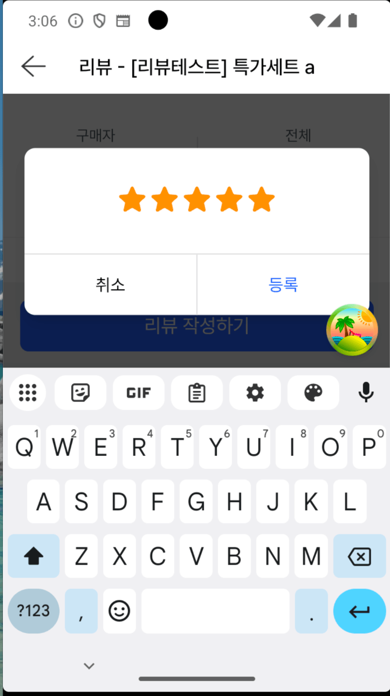

웹뷰 개발을 하다 보면 가상키보드 노출 UX에 신경 써야 하는 경우가 많은데요.

이번 글에서는 사내 서비스를 운영하면서 가상키보드가 노출되는 다이얼로그의 UX를 개선했던 경험을 공유합니다.

# 문제 상황

사내 디자인 시스템은 다이얼로그의 최대 높이를 이렇게 정해두고 있습니다.

1. 다이얼로그 높이는 내부 컨텐츠 내용만큼만 노출한다
2. 컨텐츠가 많아지면 디바이스 위아래 여백 50px을 남기고 내부 컨텐츠는 스크롤 처리한다

위 디자인 시스템 요구사항에 맞게 공용 `Dialog`의 `DialogContent`에 `max-height` 한 줄로 구현되어 있습니다.

```tsx
// 위아래 50px씩, 총 100px을 뺀 값이 다이얼로그의 최대 높이
'max-h-[calc(100vh-100px)] supports-[height:100dvh]:max-h-[calc(100dvh-100px)]'
```

작품 리뷰 작성 다이얼로그도 이 공용 컴포넌트를 그대로 씁니다. 별점을 매기고 `textarea`에 코멘트를 적은 뒤 등록하는 형태의 입력 다이얼로그입니다.

그런데 웹뷰 환경에서 테스트해보니 아래와 같이 노출되는걸 확인했습니다.



**가상키보드가 올라오는 순간 `textarea`가 사라집니다.** 별점과 취소와 등록 버튼만 남고 코멘트를 적을 공간이 화면에서 증발했습니다.

# 원인

## 1. 앱이 리사이즈 모드로 동작한다

사내 앱은 플러터로 만들어져 있는데요. 플러터에서는 키보드가 올라올 때 화면을 어떻게 다룰지 `Scaffold`의 `resizeToAvoidBottomInset` 속성으로 고를 수 있습니다.

> **Scaffold** 란? <br /> 플러터에서 화면 한 장의 기본 골격을 잡아주는 위젯입니다. 앱바와 본문, 하단 영역 같은 레이아웃 틀을 제공합니다.
>
> **resizeToAvoidBottomInset** 이란? <br /> `Scaffold` 의 속성입니다. 키보드처럼 화면 아래에서 올라오는 영역을 피해 본문 높이를 줄일지 정하며 기본값은 `true` 입니다.

이 값에 따라 동작이 둘로 갈립니다.

**리사이즈 모드** (`resizeToAvoidBottomInset: true`) : 키보드가 올라오면 웹뷰가 차지하는 영역 자체가 줄어듭니다. 안드로이드의 `adjustResize`가 여기 해당합니다.

**오버레이 모드** (`resizeToAvoidBottomInset: false`) : 웹뷰 크기는 그대로 두고 키보드가 그 위를 덮습니다. 안드로이드의 `adjustPan`이 여기 해당합니다.

앱팀에 문의해보니 저희 서비스 화면은 **리사이즈 모드**로 세팅되어 있다고 전달받았습니다.

리사이즈 모드에서는 키보드가 차지하는 높이(`MediaQuery.viewInsets.bottom`)만큼을 body 높이에서 빼버립니다. 즉 가상키보드가 노출되면 **웹뷰 프레임 자체가 줄어듭니다.**

## 2. 줄어든 뷰포트에서 또 100px을 뺀다

`max-height`는 `100dvh - 100px`인데 리사이즈 모드에서는 이 `100dvh`가 **키보드를 뺀 나머지 영역**을 가리킵니다. 그런데 거기서 위아래 여백 50px씩을 또 떼어냅니다.

실제로 얼마나 줄어드는지 안드로이드 에뮬레이터(360×640dp)에서 측정해봤습니다.


| 상태     | 뷰포트 | 다이얼로그 최대 높이 | 컨텐츠 높이 | 실제 높이               |
| ------ | --- | ----------- | ------ | ------------------- |
| 키보드 닫힘 | 529 | 429         | 379    | **379** (컨텐츠 그대로)   |
| 키보드 열림 | 254 | **154**     | 379    | **154** (최대 높이에 걸림) |


키보드가 뜬 순간 다이얼로그가 쓸 수 있는 높이가 **154px**로 쪼그라듭니다. 여기서 취소와 등록 버튼 푸터가 56px를 가져가니 본문에 남는 건 **98px** 남짓입니다.

별점 영역과 푸터의 버튼 영역은 높이가 고정되어 있어 화면이 좁아져도 그대로 지킵니다. 그러니 이 둘이 먼저 그려지고 `textarea`는 남은 자리를 받는 셈이죠.

그런데 `textarea`는 152px인데 본문에 남은 공간은 98px뿐입니다. 들어갈 자리가 없으니 결국 육안으로는 `**textarea`가 아예 없는 것처럼** 보이게 된 겁니다.

정리하면 "위아래 50px 여백"을 주기 위해 부여한 `max-h-[calc(100vh-100px)] supports-[height:100dvh]:max-h-[calc(100dvh-100px)]` **이 CSS 속성이 원인이었습니다.** 화면이 작은 기기일수록 가상키보드가 차지하는 비중이 커지므로 해당 문제가 더 심하게 나타나겠죠.

# 해결

## 키보드가 뜨면 여백을 없앤다

이를 해결하기 위해 디자인팀과 상의했는데요. 화면 높이가 좁아지는 상황에서 굳이 여백을 유지하면서까지 다이얼로그를 노출시킬 이유는 없다고 판단했습니다. 뭐가 됐든 다이얼로그 내부 컨텐츠가 잘 보이는 것이 UX 관점에서 최우선이니까요.

그래서 가상키보드 노출로 가시 영역이 좁아지면 **여백 처리를 제거하고 가능한 화면에 꽉 차게** 표시해 대응하기로 했습니다.

### 최대 높이를 100dvh 로 바꾸면 된다

키보드가 떠 있는 동안만 최대 높이를 `100dvh - 100px`에서 `100dvh`로 바꿔주면 됩니다. 리사이즈 모드에서는 `100dvh`가 곧 키보드를 제외한 가시 영역이라 정확히 원하는 값을 줍니다.

문제는 **"키보드가 떠 있는 동안"을 어떻게 아느냐**입니다.

### visualViewport 로는 키보드를 감지할 수 없다

웹에서 가상키보드를 감지하는 가장 흔한 방법은 레이아웃 뷰포트와 시각 뷰포트의 차이를 보는 것입니다.

```ts
const keyboardHeight = window.innerHeight - window.visualViewport.height
```

키보드가 웹뷰 위에 **덮이는 오버레이** 방식이라면 레이아웃 뷰포트는 그대로인데 시각 뷰포트만 줄어듭니다. 그래서 이 차이가 곧 키보드 높이가 되죠.

그런데 앞서 봤듯이 이 화면은 리사이즈 모드입니다. 웹뷰 프레임 자체가 줄어드니 레이아웃 뷰포트와 시각 뷰포트가 **둘이 함께** 줄어들죠. 결국 위 `keyboardHeight` 값은 사실상 **항상 0**이라고 봐야합니다. 저희 서비스에선 의미없는 값이죠. 

### 앱을 수정하지 않기로 한 이유

그럼 앱을 오버레이 모드로 바꾸면 되는거 아닌가요?

 `resizeToAvoidBottomInset: false`로 바꾸면 `keyboardHeight` 값이 유의미해지므로 가상키보드 노출 여부를 웹에서 간접적으로 알 수 있습니다.

하지만 비교해보니 얻는 것보다 잃는 게 많았습니다.


|                | 리사이즈      | 오버레이                                            |
| -------------- | --------- | ----------------------------------------------- |
| 키보드 시 `100dvh` | 가시 영역과 동일 | 전체 높이 그대로                                       |
| 요구사항 3 구현      | CSS 한 줄   | JS로 `visualViewport` 읽어 CSS 변수 주입 후 중앙정렬 오프셋 보정 |
| 키보드 감지         | 불필요       | 필수                                              |
| 앱 수정           | **불필요**   | 필요                                              |


오버레이로 바꾸면 웹이 키보드 높이를 직접 계산해서 다이얼로그의 위치와 높이를 보정해야 합니다. 그 로직을 다이얼로그마다 유지해야 하고요. 

무엇보다 CSS를 다루는 일에 자바스크립트가 끼어들어야 한다는 점이 마음에 걸렸습니다. 어떻게 보면 이 문제는 화면 높이에 따른 CSS 처리일 뿐인데 굳이 자바스크립트까지 끌어들일 이유는 없다고 봤거든요.

UI와 UX를 개선할 때 웬만하면 CSS 선에서 대응하고 자바스크립트까지 가져오지 않는 편이 성능에도 좋다고 생각합니다. 그래서 앱은 리사이즈 모드로 유지하는 방향으로 결정했습니다.

## 포커스로 키보드 노출을 판단한다

이 이슈는 결국 가상키보드가 노출됐을 때 UX가 나빠지는 문제입니다. 그런데 가상키보드는 아무 때나 뜨지 않습니다. 브라우저에서는 `input`이나 `textarea` 같은 입력 요소에 포커스가 갔을 때 올라오죠.

그렇다면 **CSS 레벨에서 포커스 여부만 판단할 수 있어도** 이 문제를 해결할 수 있겠다고 생각했습니다.

### 대안 1. `:has(textarea:focus)`

가장 직관적인 조건입니다. "다이얼로그 안의 `textarea`에 포커스가 있으면" 최대 높이를 `100dvh`로 올려줍니다.

리뷰 작성 다이얼로그에서 키보드를 띄우는 것까지는 완벽하게 동작했습니다. 그런데 **코멘트를 쓰다가 `textarea` 위 별점 선택 영역을 클릭하면** 다이얼로그가 줄었다 커지며 살짝 덜컥거리는 현상이 발견됐습니다.


50ms 간격으로 수치를 측정해보았습니다.


| 별점 탭 이후 | 뷰포트<br />`window.innerHeight` | 최대 높이<br />`max-height` 계산값 | 다이얼로그<br />실제 높이 | 상황                                |
| ------- | ----------------------------- | --------------------------- | ---------------- | --------------------------------- |
| 0ms     | 254                           | 254.5px                     | 255              | 별점 클릭. 포커스가 `textarea` 에서 별점으로 이동 |
| 66ms    | 254                           | 196.9px                     | 197              | 뷰포트는 아직 254인데 최대 높이만 떨어짐          |
| 82ms    | 268                           | 184.0px                     | 184              | 가장 작게 줄어든 지점                      |
| 123ms   | 383                           | 184.0px                     | 184              | 뷰포트는 커졌는데 최대 높이는 아직 184           |
| 413ms   | 529                           | 402.9px                     | 379              | 복귀. 컨텐츠 크기인 379로 안정               |


**255에서 184로 줄었다가 379로 늘어납니다.** 0.5초라는 짧은 순간이지만 누군가는 불편함을 느낄 ux입니다.

원인은 **조건이 바뀌는 시점과 뷰포트가 바뀌는 시점의 어긋남**이었습니다.

별점은 `button`이라 탭하는 순간 포커스가 `textarea`에서 버튼으로 옮겨갑니다. 그러면 `:has(textarea:focus)` 셀렉터에 **그 프레임에 바로 걸리지 않게 되고** 최대 높이가 곧바로 `100dvh`에서 `100dvh - 100px`로 떨어집니다.

그런데 키보드가 실제로 내려가고 웹뷰가 다시 커지는 건 **애니메이션**이라 300ms쯤 걸립니다. 그 사이 뷰포트는 여전히 254입니다.

시점별로 나눠 보면 이렇습니다.


| 시점                | `100dvh` | 다이얼로그 최대 높이      | 계산 결과   |
| ----------------- | -------- | ---------------- | ------- |
| 별점 탭 직전           | 254      | `100dvh`         | **254** |
| 별점 탭 직후           | 254      | `100dvh − 100px` | **154** |
| 300ms 뒤 (키보드 내려감) | 529      | `100dvh − 100px` | **429** |


즉 `**100dvh`는 아직 254인데 −100px은 이미 적용된** 구간이 잠깐 생기는 거죠. `focus`는 즉시 풀리는데 `100dvh`는 애니메이션을 따라 천천히 바뀌기 때문입니다.

여기에 `DialogContent`의 `duration-200` 트랜지션이 더해집니다. `max-height`가 즉시 바뀌지 않고 200ms에 걸쳐 변하니, 한 프레임 스쳐 지나가는 대신 줄어드는 과정이 그대로 눈에 보이게 됩니다.

기능상 문제는 없지만 별점 클릭할때마다 반복되는 움직임이라 그대로 두기엔 아쉬웠어요.

### 대안 2. `:focus-within`

그럼 조건을 느슨하게 잡아보면 어떨까요? `textarea`든 버튼이든 **내부 어디든 포커스가 있으면** 최대 높이를 올려주는 겁니다.


덜컥거림은 깔끔하게 사라졌습니다. 포커스가 `textarea`에서 버튼으로 옮겨가도 `:focus-within`은 계속 true라 최대 높이가 흔들리지 않으니까요.

대신 **다른 곳에서 문제가 생겼습니다.**

공용 `Dialog`는 리뷰 작성 말고 입력 요소가 없는 다이얼로그에도 쓰입니다. 아래는 리뷰 운영방침 안내 다이얼로그인데요.


입력 요소가 하나도 없는데 위아래 여백이 사라졌습니다.

범인은 **포커스 트랩**이었습니다. Radix는 다이얼로그를 열 때 접근성을 위해 내부 첫 요소에 포커스를 줍니다. 그러니 안내 팝업도 **열리는 순간 `:focus-within`이 true**가 되어버립니다.

그러면 `max-h-[calc(100vh-100px)]`가 적용되지 않고 최대 높이가 `100dvh`로 올라갑니다. 키보드를 띄울 일도 없는 다이얼로그에서 위아래 여백 50px 규칙만 사라진 셈이죠.

공용 `Dialog`는 프로젝트 전역으로 사용되기 때문에 이 방법도 적용하기 어려워보입니다. 

### 대안 3. `:has(textarea):focus-within`

그럼 `textarea`나 `input`처럼 가상키보드를 띄우는 요소를 가진 다이얼로그에 한해서만 내부에 포커스가 있을 때 여백을 없애면 되지 않을까요? 이렇게 구현해봤습니다.

```tsx

className={cn(
  'w-[calc(100vw-20px)] max-w-[320px] pt-8 bg-elevated-02 flex flex-col',
  // 기본: 디바이스 위아래 50px 여백을 남기고 넘치는 내용은 본문에서 스크롤합니다.
  'max-h-[calc(100vh-100px)] supports-[height:100dvh]:max-h-[calc(100dvh-100px)]',
  // 텍스트 입력이 있는 다이얼로그에 한해 내부에 포커스가 있으면(= 가상키보드 노출)
  // 여백을 없애고 가시 영역을 꽉 채웁니다.
  'has-[textarea]:focus-within:max-h-[100vh] has-[input]:focus-within:max-h-[100vh]',
  'supports-[height:100dvh]:has-[textarea]:focus-within:max-h-[100dvh]',
  'supports-[height:100dvh]:has-[input]:focus-within:max-h-[100dvh]',
  className,
)}
```

케이스별로 따져보면 이렇습니다.


| 다이얼로그 / 상태            | `:has(textarea)` | `:focus-within` | 결과                 |
| --------------------- | ---------------- | --------------- | ------------------ |
| 리뷰 작성 — textarea 포커스  | ✅                | ✅               | `100dvh`           |
| 리뷰 작성 — **별점 버튼** 포커스 | ✅                | ✅               | `100dvh` (덜컥거림 없음) |
| 리뷰 운영방침 — 확인 버튼 포커스   | ❌                | ✅               | 기본 최대 높이 (여백 50px) |


별점을 탭해도 `:has(textarea)`는 여전히 참이라 최대 높이가 유지됩니다. 안내 다이얼로그는 애초에 `textarea`가 없으니 포커스 트랩이 걸려도 조건에 걸리지 않고요.


안내 다이얼로그의 여백도 정확히 돌아왔습니다.


## 포커스는 있는데 키보드는 없는 경우도 있지 않나요?

`:focus-within`이 보는 건 키보드가 아니라 **포커스**입니다. 즉 포커스가 된 상태라고 반드시 가상키보드가 노출된 건 아닙니다.


| 상황                                | 발생              |
| --------------------------------- | --------------- |
| 안드로이드 백키나 키보드 내리기 버튼(⌄)으로 키보드만 내림 | textarea 포커스 유지 |
| 하드웨어 키보드 연결 (블루투스나 태블릿 키보드 케이스)   | 소프트 키보드 미노출     |
| PC 웹                              | 항상              |


이 상태에서 최대 높이는 `100dvh`로 남습니다. 여백 50px 규칙이 잠시 풀린 상태인 셈이죠.

그런데 **결과적으로는 무해합니다.** `max-height`는 넘지 못할 값을 정할 뿐이고 실제 높이는 컨텐츠가 결정하니까요.

애초에 `textarea`나 `input`이 포함된 다이얼로그가 디바이스 화면을 꽉 채울 만큼 길어지는 건 UX상으로도 맞지 않다고 봅니다. 그러니 사실상 문제될 일은 없을 것 같습니다.

# 마치며

웹뷰는 특성상 다양한 디바이스 환경을 대응해야 하다 보니 사소하지만 신경 쓸 부분이 참 많은 것 같습니다. 이번 문제도 CSS 몇 줄로 끝났지만 그 몇 줄을 고르기까지 여러 시행착오를 겪었습니다.

그래도 이런 자잘한 디테일을 하나씩 챙기는 것이 결국 사용자 경험을 끌어올리고 더 좋은 서비스로 이어진다고 믿습니다. 앞으로도 더 나은 서비스를 만들기 위해 디테일을 놓치지 않는 개발자가 되어야겠습니다.

<details>

<summary>참고문헌</summary>

<div markdown="1">

https://developer.mozilla.org/en-US/docs/Web/CSS/:has

https://developer.mozilla.org/en-US/docs/Web/CSS/:focus-within

https://developer.mozilla.org/en-US/docs/Web/API/VisualViewport

https://api.flutter.dev/flutter/material/Scaffold/resizeToAvoidBottomInset.html

https://web.dev/blog/viewport-units

https://developer.android.com/develop/ui/views/touch-and-input/keyboard-input/visibility

</div>

</details>

