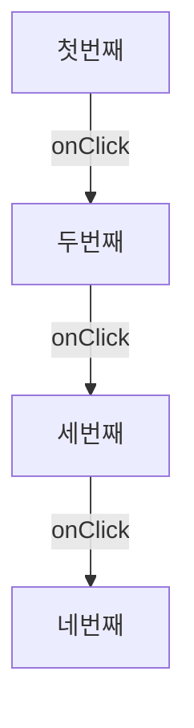

인증 플로우처럼 여러 스텝으로 구성된 화면을 개발하다 보면, 특정 스텝으로 빠르게 이동해가며 UI를 확인하고 싶을 때가 있습니다. 디버깅을 위해 매번 처음부터 폼을 채우고 넘어가는 건 꽤 번거로운 일입니다. 혹여나 실수로 새로고침이라도 한다면 다시 처음부터 진행해야하죠.

그래서 Mermaid를 렌더링 엔진으로 활용해 개발 환경에서만 동작하는 Devtool을 만들어봤습니다.


# 제작 과정


## 1단계: 유저플로우 분석

```tsx
  const [step, setStep] = useState<StepType>(1)

  const handleNextStep = (step) => {
setStep(step)
  }


   <FormProvider {...methods}>
        <form onSubmit={methods.handleSubmit(onSubmit)}>
          {step === 1 && <Step1 onNextStep={handleNextStep} />}
          {step === 2 && <Step2 onNextStep={handleNextStep} />}
          {step === 3 && <Step3 onNextStep={handleNextStep} />}
          {step === 4 && <Step4 />}
        </form>
      </FormProvider>
```

handleNextStep 핸들러 함수가 트리거 될때마다 다음 스탭으로 넘어가는 유저플로우가 있다 가정해봅시다. 

위 로직을 머메이드 문법을 사용해 텍스트로 플로우를 표현하면 다음과 같습니다. 



'각 n번째를 onclick하면 n+1단계로 간다' 라는 매우 간단한 텍스트로 이루어져있는데요. 

위와같은 스탭을 표현한 문자열을  `mermaid.render()` 함수 인자로 넘겨 렌더링하면 머메디드 다이얼로그를 띄울 수 있습니다.


## 2단계: Mermaid 그래프 문자열 만들기

그럼 Mermaid텍스트로 다이어그램을 표현해봅시다.

아래 코드는 스텝 수와 현재 스텝을 받아 그래프 정의 문자열을 만드는 함수입니다.

```ts
const buildGraphDefinition = (totalSteps: number, currentStep: number): string => {
  const steps = Array.from({ length: totalSteps }, (_, i) => i + 1)

  const nodeLines = steps.map((i) => `step_${i}["step${i}"]`)

  const edgeLines = steps
    .slice(0, -1)
    .map((i) => `step_${i} --> step_${i + 1}`)

  const styleLines =
    currentStep >= 1 && currentStep <= totalSteps
      ? [`style step_${currentStep} fill:#ff5f66,stroke:#ff3344,stroke-width:2px,color:#ffffff,font-weight:bold`]
      : []

  const clickLines = steps.map((i) => `click step_${i} ${MERMAID_CALLBACK_NAME}`)

  return ['graph TD', ...nodeLines, ...edgeLines, ...styleLines, ...clickLines].join('\n')
}
```

노드 ID를 `step_1`, `step_2` 처럼 규칙적으로 정하면 나중에 클릭 이벤트에서 역파싱하기 쉽기때문에 지정했습니다. 


그리고 현재 스텝에는 `style` 지시어로 하이라이트 색상을 직접 주입했습니다.


## 3단계: `mermaid.render`로 SVG 렌더링

다음은 이 문자열을 실제 SVG로 변환하는 단계입니다. Mermaid는 번들 크기가 크기 때문에 `import()` 동적 임포트로 필요할 때만 불러와요.

```ts
const mermaid = (await import('mermaid')).default

mermaid.initialize({
  startOnLoad: false,
  securityLevel: 'loose', // 클릭 이벤트를 위해 필요
  theme: 'dark',
})

const { svg, bindFunctions } = await mermaid.render(renderId, graphDefinition)

graphRef.current.innerHTML = svg
bindFunctions?.(graphRef.current)
```

`securityLevel: 'loose'`는 클릭 콜백 연결을 위해 반드시 필요합니다. 이 설정이 없으면 Mermaid가 인라인 핸들러를 제거해버려요.

`bindFunctions`는 렌더링된 SVG에 이벤트 바인딩을 수행하는 함수인데, Mermaid 내부에서 클릭 이벤트를 실제로 연결해주는 역할을 합니다. 이걸 빠뜨리면 노드를 클릭해도 아무 일도 일어나지 않아요.


## 4단계: 노드 클릭 → 외부 핸들러 연결

Mermaid의 `click` 지시어는 전역 함수 이름을 문자열로 받습니다.

```
click step_1 authStepMermaidCallback
click step_2 authStepMermaidCallback
```

즉, `window.authStepMermaidCallback`이 실제로 존재해야 클릭 시 호출돼요. 그래서 컴포넌트가 열릴 때 전역 함수를 등록하고, 닫힐 때 제거하도록 했습니다.

```ts
useEffect(() => {
  if (!isOpen) return

  const win = window as Window & { [MERMAID_CALLBACK_NAME]?: (nodeId: string) => void }
  win[MERMAID_CALLBACK_NAME] = onNodeClick

  return () => {
    if (win[MERMAID_CALLBACK_NAME] === onNodeClick) {
      delete win[MERMAID_CALLBACK_NAME]
    }
  }
}, [isOpen, onNodeClick])
```

클릭 시 전달되는 `nodeId`는 `"step_3"` 같은 형태예요. 여기서 숫자만 파싱하면 `onJumpStep`으로 넘길 수 있습니다.

```ts
const parseStepFromNodeId = (nodeId: string): number | undefined => {
  const match = nodeId.match(/^step_(\d+)$/)
  return match ? Number(match[1]) : undefined
}
```

노드 ID 규칙을 처음에 의도적으로 `step_N` 형태로 고정해둔 이유가 바로 이겁니다.


## 5단계: `mermaid.initialize` 중복 호출 방지

`mermaid.initialize`를 렌더링할 때마다 호출하면 경고가 발생합니다. 모듈 스코프의 플래그로 한 번만 실행되도록 막았어요.

```ts
let isMermaidInitialized = false

if (!isMermaidInitialized) {
  mermaid.initialize({ ... })
  isMermaidInitialized = true
}
```

싱글턴처럼 동작하지만, 상태를 컴포넌트 외부에 두어 리렌더링의 영향을 받지 않습니다.


## 6단계: useId로 렌더 ID 충돌 방지

같은 페이지에 Devtool이 여러 개 마운트될 경우를 대비해, `useId`로 컴포넌트별 고유 ID를 만들었어요.

```ts
const componentId = sanitizeId(useId())
const renderId = `auth_step_graph_${componentId}_${Date.now()}`
```

`useId`의 반환값에는 `:` 같은 특수문자가 포함될 수 있어서, CSS 선택자나 DOM ID로 쓰기 안전하도록 `sanitizeId`로 세니타이징했습니다.

```ts
const sanitizeId = (value: string) => value.replace(/[^a-zA-Z0-9_]/g, '_')
```


## 7단계: 커스텀 훅으로 분리

기능은 얼추 완성된 것 같으니 리팩토링을 해보겠습니다. 

렌더링 관련 로직이 커지면서 컴포넌트가 무거워졌어요. Mermaid 관련 로직을 `useMermaidGraph`훅으로 분리했습니다.

```ts
function useMermaidGraph(isOpen, graphDefinition, onNodeClick) {
  const graphRef = useRef(null)
  const [errorMessage, setErrorMessage] = useState(null)
  // ...
  return { graphRef, errorMessage }
}
```

컴포넌트는 이 훅의 반환값만 소비하면 되고, 렌더링의 세부 구현은 훅 안에 캡슐화됩니다.

## 8단계 : 디버깅 도구 오픈 버튼, 프로덕션 빌드에서 제거


디버깅 도구를 열고 닫을 간단한 버튼도 만들어주고

```tsx
      <button
        type="button"
        aria-label="Open auth step diagram devtool"
        onClick={() => setIsOpen((prev) => !prev)}
        className={cn(
          'flex h-12 w-12 items-center justify-center rounded-full text-sm font-bold text-[#111827] shadow-lg transition-colors',
          isOpen ? 'bg-[#f59e0b]' : 'bg-[#facc15]',
        )}
      >
        DEV
      </button>

```

마지막으로, 프로덕션 레벨에선 디버깅 도구가 노출되면 안되기 때문에, 프로덕션 빌드에서 컴포넌트 자체를 렌더링하지 않도록 했습니다. 

```tsx
if (process.env.NODE_ENV === 'production') return null
```

# 실제 사용 예시


실제 사용처에선 다음과 같이 props를 넘겨 사용하면 됩니다. 

```tsx
  const [step, setStep] = useState<StepType>(1)

   <FormProvider {...methods}>
        <form onSubmit={methods.handleSubmit(onSubmit)}>
          {step === 1 && <Step1 onNextStep={handleNextStep} />}
          {step === 2 && <Step2 onNextStep={handleNextStep} />}
          {step === 3 && <Step3 onNextStep={handleNextStep} />}
          {step === 4 && <Step4 />}
        </form>
      </FormProvider>
      <AuthStepDiagramDevtool title="회원가입" currentStep={step} totalSteps={4} onJumpStep={handleNextStep} />
```

아래는 실제 디버깅 도구를 활용하는 시연 영상입니다. 


# 마치며

이 디버깅 도구 덕분에 세 가지 문제를 해결할 수 있었어요.

첫째, 특정 스텝의 UI를 확인하려면 앞 단계를 모두 직접 거쳐야 하는 번거로움이 사라졌어요. 

둘째, 새로고침 시 로컬 state가 초기화되더라도 원하는 스텝으로 즉시 이동할 수 있습니다. 

셋째, 스텝 간 흐름을 그래프로 시각화해서 현재 어느 단계에 있는지 직관적으로 파악할 수 있어요.


## 아쉬운 점

다만 아쉬운 점도 있습니다.

디버깅 도구가 필요한 곳마다 컴포넌트를 직접 import해야 하고, props도 직접 넘겨야 하기 때문에 실제 플로우와 다른 값을 전달하면 예상치 못한 에러가 발생할 수 있어요.

이를 개선하기 위해 스텝 관리 방식을 toss의 useFunnel처럼 훅 형태로 만들고, 훅 내부에 디버깅 도구도 함께 종속되도록 구조를 바꿔보는 것을 고민 중입니다.


<details>

<summary>참고문헌</summary>

<div markdown="1">

https://www.youtube.com/watch?v=NwLWX2RNVcw

</div>

</details>


